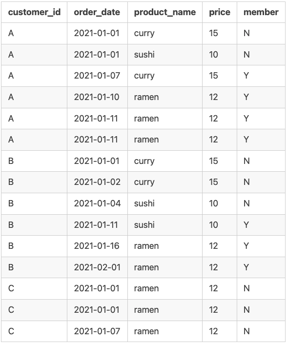
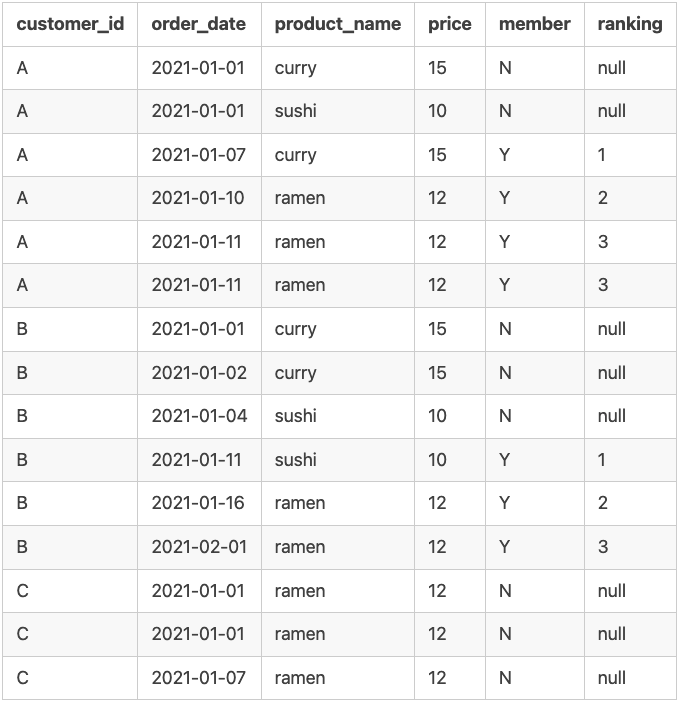

# Case Study 1 - Danny's Diner


Link: [Case Study 1 - Danny's Diner](https://8weeksqlchallenge.com/case-study-1/)

---

## Contents

- [Introduction](#introduction)
- [Entity Relationship Diagram](#entity-relationship-diagram)
- [Case Study Questions](#case-study-questions)
- [Question 1](#1-what-is-the-total-amount-each-customer-spent-at-the-restaurant)
- [Question 2](#2-how-many-days-has-each-customer-visited-the-restaurant)
- [Question 3](#3-what-was-the-first-item-from-the-menu-purchased-by-each-customer)
- [Question 4](#4-what-is-the-most-purchased-item-on-the-menu-and-how-many-times-was-it-purchased-by-all-customers)
- [Question 5](#5-which-item-was-the-most-popular-for-each-customer)
- [Question 6](#6-which-item-was-purchased-first-by-the-customer-after-they-became-a-member)
- [Question 7](#7-which-item-was-purchased-just-before-the-customer-became-a-member)
- [Question 8](#8-what-is-the-total-items-and-amount-spent-for-each-member-before-they-became-a-member)
- [Question 9](#9-if-each-1-spent-equates-to-10-points-and-sushi-has-a-2x-points-multiplier---how-many-points-would-each-customer-have)
- [Question 10](#10-in-the-first-week-after-a-customer-joins-the-program-including-their-join-date-they-earn-2x-points-on-all-items-not-just-sushi---how-many-points-do-customer-a-and-b-have-at-the-end-of-january)

---

## Introduction

Danny loves Japanese food, so he decides to open up a restaurant that sells his three favorite foods: sushi, curry, and ramen.

Danny's Diner is in need of assistance. The restaurant has captured some very basic data from the first few months of operation, but have no idea how to use their data to help them run the business.

## Entity Relationship Diagram


## Case Study Questions

In this case study, we will answer the following questions, plus a bonus question.

 1. What is the total amount each customer spent at the restaurant?
 2. How many days has each customer visited the restaurant?
 3. What was the first item from the menu purchased by each customer?
 4. What is the most purchased item on the menu and how many times was it purchased by all customers?
 5. Which item was the most popular for each customer?
 6. Which item was purchased first by the customer after they became a member?
 7. Which item was purchased just before the customer became a member?
 8. What is the total items and amount spent for each member before they became a member?
 9. If each $1 spent equates to 10 points and sushi has a 2x points multiplier - how many points would each customer have?
 10. In the first week after a customer joins the program (including their join date) they earn 2x points on all items, not just sushi - how many points do customer A and B have at the end of January?

---

### 1. What is the total amount each customer spent at the restaurant?

In this question, we want to find the total amount.
In this case, we are interested in how much each customer spent at Danny's Diner.

First, let's look at the `sales` table.

``` sql
SELECT *
FROM dannys_diner.sales;
```

| customer_id | order_date | product_id |
| ----------- | ---------- | ---------- |
| A           | 2021-01-01 | 1          |
| A           | 2021-01-01 | 2          |
| A           | 2021-01-07 | 2          |
| A           | 2021-01-10 | 3          |
| A           | 2021-01-11 | 3          |
| A           | 2021-01-11 | 3          |
| B           | 2021-01-01 | 2          |
| B           | 2021-01-02 | 2          |
| B           | 2021-01-04 | 1          |
| B           | 2021-01-11 | 1          |
| B           | 2021-01-16 | 3          |
| B           | 2021-02-01 | 3          |
| C           | 2021-01-01 | 3          |
| C           | 2021-01-01 | 3          |
| C           | 2021-01-07 | 3          |

We can see that each row represent a single sale, with the `customer_id`, `order_date`, and `product_id`.

Since we want to know how much in total *each* customer spent, we know that we need to eventually group this data by `customer_id`.

Next, we are going to examine the `product_id`.

Notice that `product_id` in `sales` is a foreign key for the `product_id` in the `menu` table.

```sql
SELECT *
FROM dannys_diner.menu;
```

| product_id | product_name | price |
| ---------- | ------------ | ----- |
| 1          | sushi        | 10    |
| 2          | curry        | 15    |
| 3          | ramen        | 12    |

Since we are interested in the total amount spent by each customer, we want to get the `price` from the `menu`.

For this, we need to combine `price` to the `sales` table corresponding to the `product_id`.

Furthermore, we are going to only focus on `customer_id` and `product_id`.

```sql
SELECT *
FROM dannys_diner.sales
INNER JOIN dannys_diner.menu
    ON sales.product_id = menu.product_id;
```

*The output table is omitted for simplicity.*

Then, we want to compute the total price for each of the customers.
To do this, we use the `SUM` function on the `price` column.

After that, we have to use the `GROUP BY` on the `customer_id` column.

```sql
SELECT 
    customer_id,
    SUM(price) as total_sales
FROM dannys_diner.sales
INNER JOIN dannys_diner.menu
    ON menu.product_id = sales.product_id
GROUP BY customer_id;
```

| customer_id | total_sales |
| ----------- | ----------- |
| B           | 74          |
| C           | 36          |
| A           | 76          |

And just for personal preference, let's sort the data by `customer_id` to ensure that it is in alphabetical order, using `ORDER BY`.
Not strictly necessary, but it looks nicer this way.

Thus, our final query for Question 1 is as follows:

```sql
SELECT 
    customer_id,
    SUM(price) as total_sales
FROM dannys_diner.sales
INNER JOIN dannys_diner.menu
    ON menu.product_id = sales.product_id
GROUP BY customer_id
ORDER BY customer_id ASC;
```

| customer_id | total_sales |
| ----------- | ----------- |
| A           | 76          |
| B           | 74          |
| C           | 36          |

**ANSWER:**

- Customer A spent a total of $76.
- Customer B spent a total of $74.
- Customer C spent a total of $36.

---

### 2. How many days has each customer visited the restaurant?

In this question, we are interested in how many days.
For this, we are going to examine the `sales` table. In particular, we are going to focus only on the columns `customer_id` and `order_date`.

```sql
SELECT
    customer_id,
    order_date
FROM dannys_diner.sales;
```

| customer_id | order_date |
| ----------- | ---------- |
| A           | 2021-01-01 |
| A           | 2021-01-01 |
| A           | 2021-01-07 |
| A           | 2021-01-10 |
| A           | 2021-01-11 |
| A           | 2021-01-11 |
| B           | 2021-01-01 |
| B           | 2021-01-02 |
| B           | 2021-01-04 |
| B           | 2021-01-11 |
| B           | 2021-01-16 |
| B           | 2021-02-01 |
| C           | 2021-01-01 |
| C           | 2021-01-01 |
| C           | 2021-01-07 |

From the first few rows, we can already see that we have duplicates of dates.
This is due to the fact that some customers have ordered more than one item on the same date.

For example, if we look at the first two rows, we see that Customer A have ordered Product 1 (sushi) and Product 2 (curry) on January 1, 2021.

Since we are interested in how many days each customer visited the restaurant rather than the total number of visits, we want to remove duplicate dates.

For this, we are going to use `DISTINCT` to ensure we remove the duplicate dates.

Next, we use `COUNT` so that we get the total count of unique visit dates, which we will save as the column `total_visits`.

Then, we need to group them by `customer_id`.
Finally, just like the previous quesiton, we use `ORDER BY` for alphabetical order.

Thus, our final SQL query is as follows:

```sql
SELECT
    customer_id,
    COUNT(DISTINCT order_date) AS total_vists
FROM dannys_diner.sales
GROUP BY customer_id
ORDER BY customer_id ASC;
```

| customer_id | total_vists |
| ----------- | ----------- |
| A           | 4           |
| B           | 6           |
| C           | 2           |

**ANSWER:**

- Customer A visited a total of 4 days.
- Customer B visited a total of 6 days.
- Customer C visited a total of 2 days.

---

### 3. What was the first item from the menu purchased by each customer?

In this problem, we are interested in identifying the first item purchased by each customer.
Let's look at `sales` once more.
(First five rows shown)

```sql
SELECT *
FROM dannys_diner.sales;
```

| customer_id | order_date | product_id |
| ----------- | ---------- | ---------- |
| A           | 2021-01-01 | 1          |
| A           | 2021-01-01 | 2          |
| A           | 2021-01-07 | 2          |
| A           | 2021-01-10 | 3          |
| A           | 2021-01-11 | 3          |

The approach we will take for this problem is creating a **CTE** (Common Table Expression), using `WITH`.
We will create a CTE called `sales_cte`.
Additionally, we will use `INNER JOIN` so that we combine the product name with the product ID.

```sql
WITH sales_cte AS (
    SELECT
        customer_id,
        order_date,
        product_name
    FROM dannys_diner.sales
    INNER JOIN dannys_diner.menu
        ON menu.product_id = sales.product_id
    ORDER BY customer_id, order_date ASC
)
/* ... */
```

This CTE gives us a table that looks like this (only the first five rows are shown):

| customer_id | order_date | product_name |
| ----------- | ---------- | ------------ |
| A           | 2021-01-01 | curry        |
| A           | 2021-01-01 | sushi        |
| A           | 2021-01-07 | curry        |
| A           | 2021-01-10 | ramen        |
| A           | 2021-01-11 | ramen        |

There are several approaches we can do from here on out.
One approach we can use is to give the sales for each customer a rank based on order.

This is where `DENSE_RANK()` comes in.
One reason we use `DENSE_RANK()` over `RANK()` in this case is because `DENSE_RANK()` allows ties and does *not* skip,
where as `RANK()` *does* skip in the sequence.

For example, with `DENSE_RANK()`, you can have something like `1, 1, 2, 3, 4, 5`.

However, with `RANK()`, you will end up with `1, 1, 3, 4, 5, 6` instead.

Aside: I believe that this should still work even if we use `RANK()` since this question asks for the first item.
However, I'm doing this since I think it's best practice, in case this or future questions asked for the second or third item instead.

Using `DENSE_RANK()`, we will partition it by `sales.customer_id`, using `PARTITION`.
That way, the sales of each customers get grouped accordingly.

Then, we use `ORDER BY` using `sales.order_date`, so that we rank the order date for each of the customers.
We use `ASC`, since we want the earliest order date to come first.

Thus, our SQL query looks like this:

```sql
WITH sales_cte AS (
  SELECT
    sales.customer_id,
    sales.order_date,
    menu.product_name,
    DENSE_RANK() OVER (
        PARTITION BY sales.customer_id
        ORDER BY sales.order_date ASC
    ) AS rank
  FROM dannys_diner.sales
  INNER JOIN dannys_diner.menu
    ON menu.product_id = sales.product_id
)
/* ... */
```

This CTE gives us a table that looks like this:

| customer_id | order_date | product_name | rank |
| ----------- | ---------- | ------------ | ---- |
| A           | 2021-01-01 | curry        | 1    |
| A           | 2021-01-01 | sushi        | 1    |
| A           | 2021-01-07 | curry        | 2    |
| A           | 2021-01-10 | ramen        | 3    |
| A           | 2021-01-11 | ramen        | 4    |
| A           | 2021-01-11 | ramen        | 4    |
| B           | 2021-01-01 | curry        | 1    |
| B           | 2021-01-02 | curry        | 2    |
| B           | 2021-01-04 | sushi        | 3    |
| B           | 2021-01-11 | sushi        | 4    |
| B           | 2021-01-16 | ramen        | 5    |
| B           | 2021-02-01 | ramen        | 6    |
| C           | 2021-01-01 | ramen        | 1    |
| C           | 2021-01-01 | ramen        | 1    |
| C           | 2021-01-07 | ramen        | 2    |

Finally, we want to extract the first item ordered by each customer.
We finish off our SQL query with a `WHERE` clause.

Thus, our final SQL query for Question 3 is as follows:

```sql
WITH sales_cte AS (
    SELECT
        sales.customer_id,
        sales.order_date,
        menu.product_name,
        DENSE_RANK() OVER (
            PARTITION BY sales.customer_id
            ORDER BY sales.order_date
        ) AS rank
    FROM dannys_diner.sales
    INNER JOIN dannys_diner.menu
        ON menu.product_id = sales.product_id
)
SELECT
    customer_id,
    product_name
FROM sales_cte
WHERE rank = 1;
```

| customer_id | product_name |
| ----------- | ------------ |
| A           | curry        |
| A           | sushi        |
| B           | curry        |
| C           | ramen        |
| C           | ramen        |

**ANSWER:**

- Customer A's first items purchased is curry and sushi.
- Customer B's first item purchased is curry.
- Customer C's first item purchased is ramen.

---

### 4. What is the most purchased item on the menu and how many times was it purchased by all customers?

We want to find out what the most popular item on the menu is among all customers.
For this, we are going to look at the `sales` table.

Since we want to not only know what is the most purchased item, but also how many times it was purchased, we are going to use `COUNT` on `product_name`, and we will save that as `total_purchased`.

Since we also want to know what the name of the most purchased item on the menu is, we are going to perform `INNER JOIN` on `menu.product_id`.

Lastly, we are going to `GROUP BY` the `product_name`, and we are going to order the table in descending order by `total_purchased`, ensuring that the most purchased item is at the top.

Thus, our final SQL query is as follows:

```sql
SELECT 
    menu.product_name,
    COUNT(product_name) AS total_purchased
FROM dannys_diner.sales
INNER JOIN dannys_diner.menu
    ON sales.product_id = menu.product_id
GROUP BY product_name
ORDER BY total_purchased DESC;
```

| product_name | total_purchased |
| ------------ | --------------- |
| ramen        | 8               |
| curry        | 4               |
| sushi        | 3               |

**ANSWER:**

Ramen is the most purchased item from this restaurant.
It was purchased a total of 8 times by all customers.

---

### 5. Which item was the most popular for each customer?

In this problem, we want to find which item was the most popular for each customer.

Let's start by looking at the `sales` table.

```sql
SELECT *
FROM dannys_diner.sales;
```

Since we want the name of the product, we are going to perform a `INNER JOIN` on `product_id`.

```sql
SELECT
    sales.customer_id
FROM dannys_diner.sales
INNER JOIN dannys_diner.menu
    ON menu.product_id = sales.product_id;
```

Since we want to know which item was the most popular, i.e., what item(s) did each customer buy the most of, we are going to use `COUNT`, and save that as the column `total_purchased`.

We are also going to use the `GROUP BY` to group `customer_id` and `product_name`.

```sql
SELECT
    sales.customer_id,
    menu.product_name,
    COUNT(sales) AS total_purchased
FROM dannys_diner.sales
INNER JOIN dannys_diner.menu
    ON menu.product_id = sales.product_id
GROUP BY customer_id, product_name;
```

| customer_id | product_name | total_purchased |
| ----------- | ------------ | --------------- |
| B           | sushi        | 2               |
| A           | curry        | 2               |
| B           | curry        | 2               |
| C           | ramen        | 3               |
| A           | sushi        | 1               |
| A           | ramen        | 3               |
| B           | ramen        | 2               |

Now, we want to rank the `total_purchased` column from highest to lowest.
For this, we are going to use `DENSE_RANK()`, partitioning the data by `customer_id` and ranking the total count of the purchases of each item.
Note that we want `DESC` so that the most purchased are ranked first.

```sql
SELECT
    sales.customer_id,
    menu.product_name,
    COUNT(sales) AS total_purchased,
    DENSE_RANK() OVER (
        PARTITION BY customer_id
        ORDER BY COUNT(sales.product_id) DESC
    ) AS rank
FROM dannys_diner.sales
INNER JOIN dannys_diner.menu
    ON menu.product_id = sales.product_id
GROUP BY customer_id, product_name;
```

| customer_id | product_name | total_purchased | rank |
| ----------- | ------------ | --------------- | ---- |
| A           | ramen        | 3               | 1    |
| A           | curry        | 2               | 2    |
| A           | sushi        | 1               | 3    |
| B           | ramen        | 2               | 1    |
| B           | curry        | 2               | 1    |
| B           | sushi        | 2               | 1    |
| C           | ramen        | 3               | 1    |

We're almost done.
We are going to convert this into a CTE.
Finally, we are going to filter only the rows where `rank = 1`, i.e., most purchased items for each customer.

Thus, our final SQL query for this problem looks like this:

```sql
WITH cte AS (
    SELECT
        sales.customer_id,
        menu.product_name,
        COUNT(sales.product_id) AS total_purchased,
        DENSE_RANK() OVER (
            PARTITION BY customer_id
            ORDER BY COUNT(sales.product_id) DESC
        ) AS rank
    FROM dannys_diner.sales
    INNER JOIN dannys_diner.menu
        ON menu.product_id = sales.product_id
    GROUP BY customer_id, product_name
)
SELECT
    customer_id,
    product_name,
    total_purchased
FROM cte
WHERE rank = 1;
```

| customer_id | product_name | total_purchased |
| ----------- | ------------ | --------------- |
| A           | ramen        | 3               |
| B           | ramen        | 2               |
| B           | curry        | 2               |
| B           | sushi        | 2               |
| C           | ramen        | 3               |

**ANSWER:**

- The most popular item for Customer A is ramen.
- The most popular items for Customer B is a tie between ramen, curry, and sushi.
- The most popular item for Customer C is ramen.

---

### 6. Which item was purchased first by the customer after they became a member?

Here, we want to know what item was purchased first by the customer after they became a member. The table `dannys_diner.members` have the data we need to know when a customer became a member. Furthermore, we also need to know the name of the product they purchased after becoming a member, thus we also need `dannys_diner.menu`.

First thing we are going to do is perform an inner join on *all* three tables.
Then, we are going to select `sales.customer_id`, `sales.order_date`, `members.join_date`, `sales.product_id`, and `menu.product_name`.

Furthermore, we are going to use the window function `DENSE_RANK()` over `sales.customer_id`, ordering by `sales.order_date` in ascending order. We will save the dense rank as `rank`.

Finally, let's save this as a CTE.

```sql
WITH cte AS (
    SELECT
        sales.customer_id,
        sales.order_date,
        members.join_date,
        sales.product_id,
        menu.product_name,
        DENSE_RANK() OVER (
            PARTITION BY sales.customer_id
            ORDER BY sales.order_date ASC
        ) AS rank
    FROM dannys_diner.sales
    INNER JOIN dannys_diner.members
        ON sales.customer_id = members.customer_id
    INNER JOIN dannys_diner.menu
        ON sales.product_id = menu.product_id
)
/* ... */
```

Now, we need to filter only the items purchased after a customer became a member.

However, this is where I personally had a problem.
If we look at the table, the only information we have about when they ordered and when they joined is the dates, `order_date` and `join_date`.

Without any further information like the actual time of ordering an item or time of becoming a member, for the case of `order_date` being the same value as `join_date`, it is impossible to determine whether the customer joined *first* then ordered afterwards, or they ordered *first* then became a member.

Because of this problem, we are going to assume both ways.

In this case, we are going to filter where `sales.order_date >= members.join_date`.

Finally, we are going to select the relevant information we need to answer this question: `customer_id`, `order_date`, `join_date`, `product_name`.

```sql
WITH cte AS (
    SELECT
        sales.customer_id,
        sales.order_date,
        members.join_date,
        sales.product_id,
        menu.product_name,
        DENSE_RANK() OVER (
            PARTITION BY sales.customer_id
            ORDER BY sales.order_date ASC
        ) AS rank
    FROM dannys_diner.sales
    INNER JOIN dannys_diner.members
        ON sales.customer_id = members.customer_id
    INNER JOIN dannys_diner.menu
        ON sales.product_id = menu.product_id
    WHERE sales.order_date >= members.join_date
    ORDER BY sales.customer_id, sales.order_date
)
SELECT
    customer_id,
    order_date,
    join_date,
    product_name
FROM cte
WHERE rank = 1;
```

| customer_id | order_date | join_date  | product_name |
| ----------- | ---------- | ---------- | ------------ |
| A           | 2021-01-07 | 2021-01-07 | curry        |
| B           | 2021-01-11 | 2021-01-09 | sushi        |

**ANSWER 1:**

Under the assumption that when the `order_date` and `join_date` are equal *and* the customers joined first before ordering on the same day:

- Customer A's first purchased item after becoming a member is curry.
- Customer B's first purchased item after becoming a member is sushi.

On the other hand, if in the case that `order_date` and `join_date` are equal, *and* the customers ordered first before becoming a member, the only change we need to make is change the conditional to `sales.order_date > members.join_date`.

Thus, we get the following SQL query:

```sql
WITH cte AS (
    SELECT
        sales.customer_id,
        sales.order_date,
        members.join_date,
        sales.product_id,
        menu.product_name,
        DENSE_RANK() OVER (
            PARTITION BY sales.customer_id
            ORDER BY sales.order_date ASC
        ) AS rank
    FROM dannys_diner.sales
    INNER JOIN dannys_diner.members
        ON sales.customer_id = members.customer_id
    INNER JOIN dannys_diner.menu
        ON sales.product_id = menu.product_id
    WHERE sales.order_date > members.join_date
    ORDER BY sales.customer_id, sales.order_date
)
SELECT
    customer_id,
    order_date,
    join_date,
    product_name
FROM cte
WHERE rank = 1;
```

| customer_id | order_date | join_date  | product_name |
| ----------- | ---------- | ---------- | ------------ |
| A           | 2021-01-10 | 2021-01-07 | ramen        |
| B           | 2021-01-11 | 2021-01-09 | sushi        |

**ANSWER 2:**

Assuming that in the case of `order_date` and `join_date` being equal, and customers ordered first then became a member:

- Customer A's first purchased item after becoming a member is ramen.
- Customer B's first purchased item after becoming a member is sushi.

---

### 7. Which item was purchased just before the customer became a member?

Here, we want to know what item each customer purchased just before becoming a member.

Let's start by creating our CTE and selecting the data we need for this problem.
In particular, we are going to do `INNER JOIN` on all three tables, since we need `menu.product_name` and `members.join_date`.
Afterwards, we are going to select `sales.customer_id`, `members.join_date`, `sales.order_date`, and `menu.product_name`.

So, our resulting CTE looks like this:

```sql
WITH cte AS (
    SELECT
        sales.customer_id,
        members.join_date,
        sales.order_date,
        menu.product_name
    FROM dannys_diner.sales
    INNER JOIN dannys_diner.menu
        ON menu.product_id = sales.product_id
    INNER JOIN dannys_diner.members
        ON members.customer_id = sales.customer_id
)
/* ... */
```

| customer_id | join_date  | order_date | product_name |
| ----------- | ---------- | ---------- | ------------ |
| A           | 2021-01-07 | 2021-01-07 | curry        |
| A           | 2021-01-07 | 2021-01-11 | ramen        |
| A           | 2021-01-07 | 2021-01-11 | ramen        |
| A           | 2021-01-07 | 2021-01-10 | ramen        |
| A           | 2021-01-07 | 2021-01-01 | sushi        |
| A           | 2021-01-07 | 2021-01-01 | curry        |
| B           | 2021-01-09 | 2021-01-04 | sushi        |
| B           | 2021-01-09 | 2021-01-11 | sushi        |
| B           | 2021-01-09 | 2021-01-01 | curry        |
| B           | 2021-01-09 | 2021-01-02 | curry        |
| B           | 2021-01-09 | 2021-01-16 | ramen        |
| B           | 2021-01-09 | 2021-02-01 | ramen        |

But we're not done with the CTE just yet.

We need to get only the rows where each customer purchased an item before they became a member.
For this, we need to use the window function `DENSE_RANK()`.

But once again, similar to the previous question, we run into this problem where it is impossible to determine in the case where `join_date` is equal to `order_date` (i.e. purchased on the same day they became a member) if they purchased the item before they became a member or vice versa. Without any further information, like the actual time of purchase and the time of becoming a member, it is impossible to know for certain, so the best we can do is assume.

**Assumption 1:** Customer ordered first before becoming member.

In this case, we are going to filter the rows in our CTE `WHERE sales.order_date <= members.join_date`.

```sql
WITH cte AS (
    SELECT
        sales.customer_id,
        members.join_date,
        sales.order_date,
        menu.product_name,
        DENSE_RANK() OVER (
            PARTITION BY sales.customer_id
            ORDER BY sales.order_date DESC
        ) AS rank
    FROM dannys_diner.sales
    INNER JOIN dannys_diner.menu
        ON menu.product_id = sales.product_id
    INNER JOIN dannys_diner.members
        ON members.customer_id = sales.customer_id
    WHERE sales.order_date <= members.join_date
)
/* ... */
```

Our CTE looks like this:

| customer_id | join_date  | order_date | product_name | rank |
| ----------- | ---------- | ---------- | ------------ | ---- |
| A           | 2021-01-07 | 2021-01-07 | curry        | 1    |
| A           | 2021-01-07 | 2021-01-01 | sushi        | 2    |
| A           | 2021-01-07 | 2021-01-01 | curry        | 2    |
| B           | 2021-01-09 | 2021-01-04 | sushi        | 1    |
| B           | 2021-01-09 | 2021-01-02 | curry        | 2    |
| B           | 2021-01-09 | 2021-01-01 | curry        | 3    |

Notice that the latest dates are ranked first for each customers.
Thus, our next step is to select the columns we need for this problem: `customer_id`, `product_name`.
Finally, for our last step, we need to filter the rows where `rank = 1`.

Thus, our final SQL query is as follows:

**Assumption 1:** Customer ordered first *before* becoming member.

In this case, we are going to filter the rows in our CTE `WHERE sales.order_date <= members.join_date`.

```sql
WITH cte AS (
    SELECT
        sales.customer_id,
        members.join_date,
        sales.order_date,
        menu.product_name,
        DENSE_RANK() OVER (
            PARTITION BY sales.customer_id
            ORDER BY sales.order_date DESC
        ) AS rank
    FROM dannys_diner.sales
    INNER JOIN dannys_diner.menu
        ON menu.product_id = sales.product_id
    INNER JOIN dannys_diner.members
        ON members.customer_id = sales.customer_id
    WHERE sales.order_date <= members.join_date
)
SELECT
    customer_id,
    product_name
FROM cte
WHERE rank = 1;
```

| customer_id | product_name |
| ----------- | ------------ |
| A           | curry        |
| B           | sushi        |

**ANSWER 1:**

Under Assumption 1:

- Customer A's last purchased item before becoming a member is curry.
- Customer B's last purchased item before becomign a member is sushi.

**Assumption 2:** Customer ordered *after* becoming member.

In this case, we are going to filter the rows in our CTE `WHERE sales.order_date < members.join_date`.

Then, the remaining steps are similar to that of Assumtion 1, and we are done.

```sql
WITH cte AS (
    SELECT
        sales.customer_id,
        members.join_date,
        sales.order_date,
        menu.product_name,
        DENSE_RANK() OVER (
            PARTITION BY sales.customer_id
            ORDER BY sales.order_date DESC
        ) AS rank
    FROM dannys_diner.sales
    INNER JOIN dannys_diner.menu
        ON menu.product_id = sales.product_id
    INNER JOIN dannys_diner.members
        ON members.customer_id = sales.customer_id
    WHERE sales.order_date < members.join_date
)
SELECT
    customer_id,
    product_name
FROM cte
WHERE rank = 1;
```

| customer_id | product_name |
| ----------- | ------------ |
| A           | sushi        |
| A           | curry        |
| B           | sushi        |

**ANSWER 2:**

Under Assumption 2:

- Customer A's last purchased items before becoming a member are sushi and curry.
- Customer B's last purchased item before becoming a member is sushi.

---

### 8. What is the total items and amount spent for each member before they became a member?

We are interested in knowing the total amount spent (in dollars) and the total number of items each member spent before becoming a member.

First, we know that we need the name of each items (`menu.product_name`) as well as the price of each item (`menu.price`). Furthermore, we know that we need the information on when the customers became a member (`members.join_date`).

So, we are going to do an `INNER JOIN` for all three tables, and we are going to filter only the rows where `sales.order_date < members.join_date`.

Thus, our SQL query is as follows:

```sql
SELECT
    sales.customer_id,
    members.join_date,
    sales.order_date,
    menu.product_name,
    menu.price
FROM dannys_diner.sales
INNER JOIN dannys_diner.menu
    ON menu.product_id = sales.product_id
INNER JOIN dannys_diner.members
    ON members.customer_id = sales.customer_id
WHERE sales.order_date < members.join_date
ORDER BY sales.customer_id, sales.order_date;
```

| customer_id | join_date  | order_date | product_name | price |
| ----------- | ---------- | ---------- | ------------ | ----- |
| A           | 2021-01-07 | 2021-01-01 | sushi        | 10    |
| A           | 2021-01-07 | 2021-01-01 | curry        | 15    |
| B           | 2021-01-09 | 2021-01-01 | curry        | 15    |
| B           | 2021-01-09 | 2021-01-02 | curry        | 15    |
| B           | 2021-01-09 | 2021-01-04 | sushi        | 10    |

With this table, which we will save as a CTE in the next step, we want to know the total price each customer spent and the total number of items.
Therefore, we are going to use the aggregate functions `COUNT` to find the total number of items, calling it `total_items`.
We are also going to use `SUM` to find the total price, and we will call it `total_price`.
Finally, we are going to `GROUP BY` the `customer_id`.

Thus, our final SQL query for this problem is as follows:

```sql
WITH purchase_before_membership AS (
    SELECT
        sales.customer_id,
        members.join_date,
        sales.order_date,
        menu.product_name,
        menu.price
    FROM dannys_diner.sales
    INNER JOIN dannys_diner.menu
        ON menu.product_id = sales.product_id
    INNER JOIN dannys_diner.members
        ON members.customer_id = sales.customer_id
    WHERE sales.order_date < members.join_date
    ORDER BY sales.customer_id, sales.order_date
)
SELECT
    cte.customer_id,
    COUNT(cte.product_name) AS total_items,
    SUM(cte.price) AS total_price
FROM purchase_before_membership AS cte
GROUP BY customer_id;
```

| customer_id | total_items | total_price |
| ----------- | ----------- | ----------- |
| A           | 2           | 25          |
| B           | 3           | 40          |

**ANSWER:**

- Before becoming a member, Customer A purchased a total of 2 items and spent a total of $25.
- Before becoming a member, Customer B purchased a total of 3 items and spent a total of $40.

---

### 9. If each $1 spent equates to 10 points and sushi has a 2x points multiplier - how many points would each customer have?

First, let's start by extracting the necessary information we need for this problem.
We know we need `sales.customer_id`, `menu.product_name`, and we also need `menu.price`.
So, we are going to `INNER JOIN` both the `menu` and `sales` table on `product_id`.

```sql
SELECT
    sales.customer_id,
    menu.product_name,
    menu.price
FROM dannys_diner.sales
INNER JOIN dannys_diner.menu
    ON menu.product_id = sales.product_id
ORDER BY sales.customer_id
LIMIT 5;
```

| customer_id | product_name | price |
| ----------- | ------------ | ----- |
| A           | curry        | 15    |
| A           | ramen        | 12    |
| A           | ramen        | 12    |
| A           | ramen        | 12    |
| A           | sushi        | 10    |

Next, we are going to use `CASE` expression to implement an if-else to check if the `sales.product_id = 1` (i.e. it is sushi). If so, then we will multiply the price by 20.
Otherwise, we will multiply the price by 10.
We are going to save the results into the column `points`.

```sql
SELECT
    sales.customer_id,
    menu.product_name,
    menu.price,
    CASE
        WHEN sales.product_id = 1 THEN menu.price * 20
        ELSE menu.price * 10
    END AS points
FROM dannys_diner.sales
INNER JOIN dannys_diner.menu
    ON menu.product_id = sales.product_id
ORDER BY sales.customer_id;
```

(First 5 rows)

| customer_id | product_name | price | points |
| ----------- | ------------ | ----- | ------ |
| A           | curry        | 15    | 150    |
| A           | ramen        | 12    | 120    |
| A           | ramen        | 12    | 120    |
| A           | ramen        | 12    | 120    |
| A           | sushi        | 10    | 200    |

We are going to save this as a CTE called `points_cte`.

We are almost done. Now, we want the total number of points for each customer.
For that, we are going to use `SUM(points)` for the total number of points, and we will save it as `total_points`.
Finally, we are going to `GROUP BY` according to `customer_id`.

Therefore, our final SQL query is as follows:

```sql
WITH points_cte AS (
    SELECT
        sales.customer_id,
        menu.product_name,
        menu.price,
        CASE
            WHEN sales.product_id = 1 THEN menu.price * 20
            ELSE menu.price * 10
        END AS points
    FROM dannys_diner.sales
    INNER JOIN dannys_diner.menu
        ON menu.product_id = sales.product_id
    ORDER BY sales.customer_id
)
SELECT
    cte.customer_id,
    SUM(points) AS total_points
FROM points_cte AS cte
GROUP BY cte.customer_id;
```

| customer_id | total_points |
| ----------- | ------------ |
| A           | 860          |
| B           | 940          |
| C           | 360          |

**ANSWER:**

- Customer A has a total of 860 points.
- Customer B has a total of 940 points.
- Customer C has a total of 360 points.

---

### 10. In the first week after a customer joins the program (including their join date) they earn 2x points on all items, not just sushi - how many points do customer A and B have at the end of January?

In this problem, we are focused on the first week after a customer becomes a member, which includes their join date.
And unlike the previous problem, this time all item on the menu are 2x the points.
We want to know how many points do each customer, primarily A and B, have at the end of January.

The first thing we are going to do is determine what data we need.
Since we need to know the `members.join_date` of each member customer, we are going to use `INNER JOIN` to combine `sales` and `members` on `customer_id`.

We also need `sales.order_date` so that we determine the items purchased within the first week after becoming a member and double the points accordingly.

And just like the last problem, we need the `menu.price` to calculate the points based on the price of the item.

So far, our SQL query looks like this, and we will eventually save this into a CTE called `members_cte`:

```sql
SELECT
    sales.customer_id,
    sales.order_date,
    sales.product_id,
    members.join_date,
    menu.price
FROM dannys_diner.sales
INNER JOIN dannys_diner.members
    ON members.customer_id = sales.customer_id
INNER JOIN dannys_diner.menu
    ON menu.product_id = sales.product_id;
```

| customer_id | order_date | product_id | join_date  | price |
| ----------- | ---------- | ---------- | ---------- | ----- |
| A           | 2021-01-07 | 2          | 2021-01-07 | 15    |
| A           | 2021-01-11 | 3          | 2021-01-07 | 12    |
| A           | 2021-01-11 | 3          | 2021-01-07 | 12    |
| A           | 2021-01-10 | 3          | 2021-01-07 | 12    |
| A           | 2021-01-01 | 1          | 2021-01-07 | 10    |
| A           | 2021-01-01 | 2          | 2021-01-07 | 15    |
| B           | 2021-01-04 | 1          | 2021-01-09 | 10    |
| B           | 2021-01-11 | 1          | 2021-01-09 | 10    |
| B           | 2021-01-01 | 2          | 2021-01-09 | 15    |
| B           | 2021-01-02 | 2          | 2021-01-09 | 15    |
| B           | 2021-01-16 | 3          | 2021-01-09 | 12    |
| B           | 2021-02-01 | 3          | 2021-01-09 | 12    |

Next, we want to know which row, which sales, are within the week after the customer became a member.
Recall that there are 7 days in a week.
To get the date one week after the customer became a member, including the join date, we add 6 to the `join_date`.
To determine if a purchase is within the week after the member became a member (including the join date), we write the following conditional. Note that it's important to use `AND` since we want only the dates in between the 7-day range to count towards the bonus. Note that this will return a Boolean (true or false).
Finally, we will save this into a column `is_valid`:

```sql
(
    sales.order_date >= members.join_date AND
    sales.order_date <= members.join_date + 6
) AS is_valid
```

Furthermore, recall that the problem states "by the end of January".
Thus, we are only interested in `order_date` where the month is January (1).

We can use `EXTRACT(MONTH FROM sales.order_date) = 1` to extract the month from `sales.order_date` and check to make sure it is January.

Combining everything we've done thus far, we get the following SQL query:

```sql
WITH members_cte AS (
    SELECT
        sales.customer_id,
        members.join_date,
        sales.order_date,
        sales.product_id,
        menu.price,
        (
            sales.order_date >= members.join_date AND
            sales.order_date <= members.join_date + 6
        ) AS is_valid
    FROM dannys_diner.sales
    INNER JOIN dannys_diner.members
        ON members.customer_id = sales.customer_id
    INNER JOIN dannys_diner.menu
        ON menu.product_id = sales.product_id
    WHERE (
        EXTRACT(MONTH FROM sales.order_date) = 1
    )
    ORDER BY sales.customer_id, sales.order_date
)
SELECT
    *
FROM members_cte;
```

| customer_id | join_date  | order_date | product_id | price | is_valid |
| ----------- | ---------- | ---------- | ---------- | ----- | -------- |
| A           | 2021-01-07 | 2021-01-01 | 2          | 15    | false    |
| A           | 2021-01-07 | 2021-01-01 | 1          | 10    | false    |
| A           | 2021-01-07 | 2021-01-07 | 2          | 15    | true     |
| A           | 2021-01-07 | 2021-01-10 | 3          | 12    | true     |
| A           | 2021-01-07 | 2021-01-11 | 3          | 12    | true     |
| A           | 2021-01-07 | 2021-01-11 | 3          | 12    | true     |
| B           | 2021-01-09 | 2021-01-01 | 2          | 15    | false    |
| B           | 2021-01-09 | 2021-01-02 | 2          | 15    | false    |
| B           | 2021-01-09 | 2021-01-04 | 1          | 10    | false    |
| B           | 2021-01-09 | 2021-01-11 | 1          | 10    | true     |
| B           | 2021-01-09 | 2021-01-16 | 3          | 12    | false    |

But we're not done yet!

Now, we need to compute the points.

We are using the same rules from problem 9, which is that every $1 spent is 10 points, with sushi being twice the points.

Here, the rule is slightly different.
Every item, not just sushi, within the week after a customer became a member gets double points.

Just like the previous problem, we are going to use `CASE` to create a few if-else expressions:

- If the order is within the week after the customer joined, regardless of what item it is, the points are calculated as price * 20.
- If the order is NOT within the week after the customer joined, AND the item is sushi, the points are calculated as price * 20.
- Otherwise, the points are calculated as price * 10.

This translates to the following SQL `CASE` expression:

```sql
CASE
    WHEN (is_valid) THEN price * 20
    WHEN (NOT is_valid AND product_id = 1) THEN price * 20
    ELSE price * 10
END AS points
```

Combining everything, we get the following SQL query:

```sql
WITH members_cte AS (
    SELECT
        sales.customer_id,
        members.join_date,
        sales.order_date,
        sales.product_id,
        menu.price,
        (
            sales.order_date >= members.join_date AND
            sales.order_date <= members.join_date + 6
        ) AS is_valid
    FROM dannys_diner.sales
    INNER JOIN dannys_diner.members
        ON members.customer_id = sales.customer_id
    INNER JOIN dannys_diner.menu
        ON menu.product_id = sales.product_id
    WHERE (
        EXTRACT(MONTH FROM sales.order_date) = 1
    )
    ORDER BY sales.customer_id, sales.order_date
)
SELECT
    *,
    CASE
        WHEN (is_valid) THEN price * 20
        WHEN (NOT is_valid AND product_id = 1) THEN price * 20
        ELSE price * 10
    END AS points
FROM members_cte AS cte;
```

| customer_id | join_date  | order_date | product_id | price | is_valid | points |
| ----------- | ---------- | ---------- | ---------- | ----- | -------- | ------ |
| A           | 2021-01-07 | 2021-01-01 | 2          | 15    | false    | 150    |
| A           | 2021-01-07 | 2021-01-01 | 1          | 10    | false    | 200    |
| A           | 2021-01-07 | 2021-01-07 | 2          | 15    | true     | 300    |
| A           | 2021-01-07 | 2021-01-10 | 3          | 12    | true     | 240    |
| A           | 2021-01-07 | 2021-01-11 | 3          | 12    | true     | 240    |
| A           | 2021-01-07 | 2021-01-11 | 3          | 12    | true     | 240    |
| B           | 2021-01-09 | 2021-01-01 | 2          | 15    | false    | 150    |
| B           | 2021-01-09 | 2021-01-02 | 2          | 15    | false    | 150    |
| B           | 2021-01-09 | 2021-01-04 | 1          | 10    | false    | 200    |
| B           | 2021-01-09 | 2021-01-11 | 1          | 10    | true     | 200    |
| B           | 2021-01-09 | 2021-01-16 | 3          | 12    | false    | 120    |

We're almost there!
The last thing we need to do is get the total points for each customer.

Before we do this, we are actually going to transform this into a second CTE, called `points_cte`.
Then, we are going to use `SUM` on the `points` column to compute the total number of points, and save it as `total_points`.
Finally, we are going to group according to each customers, using `GROUP BY` on `customer_id`.

Therefore, our final SQL query is as follows:

```sql
WITH members_cte AS (
    SELECT
        sales.customer_id,
        members.join_date,
        sales.order_date,
        sales.product_id,
        menu.price,
        (
            sales.order_date >= members.join_date AND
            sales.order_date <= members.join_date + 6
        ) AS is_valid
    FROM dannys_diner.sales
    INNER JOIN dannys_diner.members
        ON members.customer_id = sales.customer_id
    INNER JOIN dannys_diner.menu
        ON menu.product_id = sales.product_id
    WHERE (
        EXTRACT(MONTH FROM sales.order_date) = 1
    )
    ORDER BY sales.customer_id, sales.order_date
),
points_cte AS (
    SELECT
        *,
        CASE
            WHEN (cte1.is_valid) THEN cte1.price * 20
            WHEN (NOT cte1.is_valid AND cte1.product_id = 1) THEN cte1.price * 20
            ELSE cte1.price * 10
        END AS points
    FROM members_cte AS cte1
)
SELECT
    cte2.customer_id,
    SUM(cte2.points) AS total_points
FROM points_cte AS cte2
GROUP BY cte2.customer_id;
```

| customer_id | total_points |
| ----------- | ------------ |
| A           | 1370         |
| B           | 820          |

**ANSWER:**

- Customer A has a total of 1370 points.
- Customer B has a total of 820 points.

---

## Bonus Questions

### Join All The Things

The following questions are related to creating basic data tables that Danny and his team can use to quickly derive insights without needing to join the underlying tables using SQL.

Recreate the following table output using the available data:



We are tasked with recreating this table in the screenshot above.
This table we are trying to recreate has the following columns:
`customer_id`, `order_date`, `product_name`, `price`, and `member`.

The first thing we are going to do is use `JOIN` to combine all three tables.
We are going to use two different joins. For `dannys_diner.sales`, we are going to use `INNER JOIN` so that for each customer's purchase, there is a corresponding `product_name` and `price`.
For `dannys_diners.members`, we are actually going to perform a `LEFT JOIN`, since we want to keep all of the customers, and `INNER JOIN` would remove Customer C out of the output table. Furthermore, we want to be able to determine eventually if a customer is a member or not.

```sql
SELECT *
FROM dannys_diner.sales
INNER JOIN dannys_diner.menu
    ON menu.product_id = sales.product_id
LEFT JOIN dannys_diner.members
    ON sales.customer_id = members.customer_id;
```

| customer_id | order_date | product_id | product_id | product_name | price | customer_id | join_date  |
| ----------- | ---------- | ---------- | ---------- | ------------ | ----- | ----------- | ---------- |
| A           | 2021-01-07 | 2          | 2          | curry        | 15    | A           | 2021-01-07 |
| A           | 2021-01-11 | 3          | 3          | ramen        | 12    | A           | 2021-01-07 |
| A           | 2021-01-11 | 3          | 3          | ramen        | 12    | A           | 2021-01-07 |
| A           | 2021-01-10 | 3          | 3          | ramen        | 12    | A           | 2021-01-07 |
| A           | 2021-01-01 | 1          | 1          | sushi        | 10    | A           | 2021-01-07 |
| A           | 2021-01-01 | 2          | 2          | curry        | 15    | A           | 2021-01-07 |
| B           | 2021-01-04 | 1          | 1          | sushi        | 10    | B           | 2021-01-09 |
| B           | 2021-01-11 | 1          | 1          | sushi        | 10    | B           | 2021-01-09 |
| B           | 2021-01-01 | 2          | 2          | curry        | 15    | B           | 2021-01-09 |
| B           | 2021-01-02 | 2          | 2          | curry        | 15    | B           | 2021-01-09 |
| B           | 2021-01-16 | 3          | 3          | ramen        | 12    | B           | 2021-01-09 |
| B           | 2021-02-01 | 3          | 3          | ramen        | 12    | B           | 2021-01-09 |
| C           | 2021-01-01 | 3          | 3          | ramen        | 12    |             |            |
| C           | 2021-01-01 | 3          | 3          | ramen        | 12    |             |            |
| C           | 2021-01-07 | 3          | 3          | ramen        | 12    |             |            |

So far so good.
Now, we could create a CTE, but we can actually recreate the desired table directly.

We will select `sales.customer_id`, `sales.order_date`, `menu.product_name`, and `menu.price`.
We are almost done. We have 4 out of the 5 columns needed to recreate the desired output table.
The last thing we need is to create the column `member`, which is either 'Y' (Yes) if the customer is a member at the time of purchase, or 'N' (No) otherwise.

To achieve this, we will use a `CASE` expression:

- If `join_date` is not `NULL` and the `order_date` is on or after the `join_date` (since the screenshot table puts 'Y' for same day), then the customer is a member
- If `join_date` is not `NULL` and the `order_date` is before.
- If `join_date` is `NULL`, then the customer is not a member.

Finally, we need to use `ORDER BY` to sort the table by `sales.customer_id`, `sales.order_date`, and `menu.product_name`, and we are done.

Combining everything, our final SQL query for this bonus question looks like this:

```sql
SELECT
    sales.customer_id,
    sales.order_date,
    menu.product_name,
    menu.price,
    CASE
        WHEN (
            members.join_date IS NOT NULL AND
            sales.order_date >= members.join_date) THEN 'Y'
        WHEN (
            members.join_date IS NOT NULL AND
            sales.order_date < members.join_date) THEN 'N'
        ELSE 'N'        
    END AS member
FROM dannys_diner.sales
INNER JOIN dannys_diner.menu
    ON menu.product_id = sales.product_id
LEFT JOIN dannys_diner.members
    ON sales.customer_id = members.customer_id
ORDER BY sales.customer_id, sales.order_date, menu.product_name;
```

| customer_id | order_date | product_name | price | member |
| ----------- | ---------- | ------------ | ----- | ------ |
| A           | 2021-01-01 | curry        | 15    | N      |
| A           | 2021-01-01 | sushi        | 10    | N      |
| A           | 2021-01-07 | curry        | 15    | Y      |
| A           | 2021-01-10 | ramen        | 12    | Y      |
| A           | 2021-01-11 | ramen        | 12    | Y      |
| A           | 2021-01-11 | ramen        | 12    | Y      |
| B           | 2021-01-01 | curry        | 15    | N      |
| B           | 2021-01-02 | curry        | 15    | N      |
| B           | 2021-01-04 | sushi        | 10    | N      |
| B           | 2021-01-11 | sushi        | 10    | Y      |
| B           | 2021-01-16 | ramen        | 12    | Y      |
| B           | 2021-02-01 | ramen        | 12    | Y      |
| C           | 2021-01-01 | ramen        | 12    | N      |
| C           | 2021-01-01 | ramen        | 12    | N      |
| C           | 2021-01-07 | ramen        | 12    | N      |

### Rank All The Things

Danny also requires further information about the `ranking` of customer products, but he purposely does not need the ranking for non-member purchases so he expects null `ranking` values for the records when customers are not yet part of the loyalty program.



Our task is to recreate the table in the screenshot above, which is the same as the table from the previous problem, with the addition of the `ranking` column.

So, our first step is to turn the SQL code from the previous problem into a CTE, which we will call `members_cte`:

```sql
WITH members_cte AS (
    SELECT
        sales.customer_id,
        sales.order_date,
        menu.product_name,
        menu.price,
        CASE
            WHEN (
              members.join_date IS NOT NULL AND
              sales.order_date >= members.join_date) THEN 'Y'
            WHEN (
              members.join_date IS NOT NULL AND
              sales.order_date < members.join_date) THEN 'N'
            ELSE 'N'        
        END AS member
    FROM dannys_diner.sales
    INNER JOIN dannys_diner.menu
        ON menu.product_id = sales.product_id
    LEFT JOIN dannys_diner.members
        ON sales.customer_id = members.customer_id
    ORDER BY sales.customer_id, sales.order_date, menu.product_name
)
/* ... */
```

Now, we need to figure out a way to recreate the `ranking` column.

I'll be honest, I'm a bit confused by what the creator of this problem meant by ranking. But from the looks of it, it seems that it is ranked based on order, with the earliest purchased items after becoming a member being ranked 1. Furthermore, there are ties in ranking, specifically on same day order dates.

For this, we are going to use `DENSE_RANK()`.
We are going to partition by `customer_id` and `member`. It's important to include `member` as well, otherwise we would be including purchases as a non-member into the ranking.

Thus, we have the following:

```sql
WITH members_cte AS (
    SELECT
        sales.customer_id,
        sales.order_date,
        menu.product_name,
        menu.price,
        CASE
            WHEN (
              members.join_date IS NOT NULL AND
              sales.order_date >= members.join_date) THEN 'Y'
            WHEN (
              members.join_date IS NOT NULL AND
              sales.order_date < members.join_date) THEN 'N'
            ELSE 'N'        
        END AS member
    FROM dannys_diner.sales
    INNER JOIN dannys_diner.menu
        ON menu.product_id = sales.product_id
    LEFT JOIN dannys_diner.members
        ON sales.customer_id = members.customer_id
    ORDER BY sales.customer_id, sales.order_date, menu.product_name
)
SELECT
    *,
    DENSE_RANK() OVER (
        PARTITION BY cte1.customer_id, cte1.member
        ORDER BY cte1.order_date ASC
    ) AS ranking
FROM members_cte AS cte1;
```

| customer_id | order_date | product_name | price | member | ranking |
| ----------- | ---------- | ------------ | ----- | ------ | ------- |
| A           | 2021-01-01 | curry        | 15    | N      | 1       |
| A           | 2021-01-01 | sushi        | 10    | N      | 1       |
| A           | 2021-01-07 | curry        | 15    | Y      | 1       |
| A           | 2021-01-10 | ramen        | 12    | Y      | 2       |
| A           | 2021-01-11 | ramen        | 12    | Y      | 3       |
| A           | 2021-01-11 | ramen        | 12    | Y      | 3       |
| B           | 2021-01-01 | curry        | 15    | N      | 1       |
| B           | 2021-01-02 | curry        | 15    | N      | 2       |
| B           | 2021-01-04 | sushi        | 10    | N      | 3       |
| B           | 2021-01-11 | sushi        | 10    | Y      | 1       |
| B           | 2021-01-16 | ramen        | 12    | Y      | 2       |
| B           | 2021-02-01 | ramen        | 12    | Y      | 3       |
| C           | 2021-01-01 | ramen        | 12    | N      | 1       |
| C           | 2021-01-01 | ramen        | 12    | N      | 1       |
| C           | 2021-01-07 | ramen        | 12    | N      | 2       |

We're almost there.
The last thing we need to do is convert the `ranking` corresponding to purchases made before the customer became a member into `NULL`.

The approach I went is to actually convert this into a second CTE, which we will call `members_ranking_cte`. Then, using a `CASE` expression, we check if `member = 'Y'`, in which case, we keep the `ranking`. Otherwise, we set `ranking` to `NULL`.

Therefore, our final SQL query is as follows:

```sql
WITH members_cte AS (
    SELECT
        sales.customer_id,
        sales.order_date,
        menu.product_name,
        menu.price,
        CASE
            WHEN (
              members.join_date IS NOT NULL AND
              sales.order_date >= members.join_date) THEN 'Y'
            WHEN (
              members.join_date IS NOT NULL AND
              sales.order_date < members.join_date) THEN 'N'
            ELSE 'N'        
        END AS member
    FROM dannys_diner.sales
    INNER JOIN dannys_diner.menu
        ON menu.product_id = sales.product_id
    LEFT JOIN dannys_diner.members
        ON sales.customer_id = members.customer_id
    ORDER BY sales.customer_id, sales.order_date, menu.product_name
),
members_ranking_cte AS (
    SELECT
        *,
        DENSE_RANK() OVER (
            PARTITION BY cte1.customer_id, cte1.member
            ORDER BY cte1.order_date ASC
        ) AS ranking
    FROM members_cte AS cte1
)

SELECT
    cte2.customer_id,
    cte2.order_date,
    cte2.product_name,
    cte2.price,
    cte2.member,
    CASE
        WHEN (cte2.member = 'Y') THEN cte2.ranking
        ELSE NULL
    END AS ranking
FROM members_ranking_cte AS cte2;
```

| customer_id | order_date | product_name | price | member | ranking |
| ----------- | ---------- | ------------ | ----- | ------ | ------- |
| A           | 2021-01-01 | curry        | 15    | N      | null    |
| A           | 2021-01-01 | sushi        | 10    | N      | null    |
| A           | 2021-01-07 | curry        | 15    | Y      | 1       |
| A           | 2021-01-10 | ramen        | 12    | Y      | 2       |
| A           | 2021-01-11 | ramen        | 12    | Y      | 3       |
| A           | 2021-01-11 | ramen        | 12    | Y      | 3       |
| B           | 2021-01-01 | curry        | 15    | N      | null    |
| B           | 2021-01-02 | curry        | 15    | N      | null    |
| B           | 2021-01-04 | sushi        | 10    | N      | null    |
| B           | 2021-01-11 | sushi        | 10    | Y      | 1       |
| B           | 2021-01-16 | ramen        | 12    | Y      | 2       |
| B           | 2021-02-01 | ramen        | 12    | Y      | 3       |
| C           | 2021-01-01 | ramen        | 12    | N      | null    |
| C           | 2021-01-01 | ramen        | 12    | N      | null    |
| C           | 2021-01-07 | ramen        | 12    | N      | null    |
