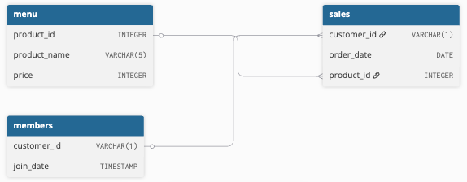

# Case Study 1 - Danny's Diner


Link: [Case Study 1 - Danny's Diner](https://8weeksqlchallenge.com/case-study-1/)

---

## Contents

- [Introduction](#introduction)
- [Entity Relationship Diagram](#entity-relationship-diagram)
- [Case Study Questions](#case-study-questions)
- [Question 1](#1-what-is-the-total-amount-each-customer-spent-at-the-restaurant)
- [Question 2](#2-how-many-days-has-each-customer-visited-the-restaurant)
- [Question 3](#3-what-was-the-first-item-from-the-menu-purchased-by-each-customer)
- [Question 4](#4-what-is-the-most-purchased-item-on-the-menu-and-how-many-times-was-it-purchased-by-all-customers)
- [Question 5](#5-which-item-was-the-most-popular-for-each-customer)
- [Question 6](#6-which-item-was-purchased-first-by-the-customer-after-they-became-a-member)
- [Question 7](#7-which-item-was-purchased-just-before-the-customer-became-a-member)
- [Question 8](#8-what-is-the-total-items-and-amount-spent-for-each-member-before-they-became-a-member)
- [Question 9](#9-if-each-1-spent-equates-to-10-points-and-sushi-has-a-2x-points-multiplier---how-many-points-would-each-customer-have)
- [Question 10](#10-in-the-first-week-after-a-customer-joins-the-program-including-their-join-date-they-earn-2x-points-on-all-items-not-just-sushi---how-many-points-do-customer-a-and-b-have)

---

## Introduction

Danny loves Japanese food, so he decides to open up a restaurant that sells his three favorite foods: sushi, curry, and ramen.

Danny's Diner is in need of assistance. The restaurant has captured some very basic data from the first few months of operation, but have no idea how to use their data to help them run the business.

## Entity Relationship Diagram



## Case Study Questions

In this case study, we will answer the following questions, plus a bonus question.

 1. What is the total amount each customer spent at the restaurant?
 2. How many days has each customer visited the restaurant?
 3. What was the first item from the menu purchased by each customer?
 4. What is the most purchased item on the menu and how many times was it purchased by all customers?
 5. Which item was the most popular for each customer?
 6. Which item was purchased first by the customer after they became a member?
 7. Which item was purchased just before the customer became a member?
 8. What is the total items and amount spent for each member before they became a member?
 9. If each $1 spent equates to 10 points and sushi has a 2x points multiplier - how many points would each customer have?
 10. In the first week after a customer joins the program (including their join date) they earn 2x points on all items, not just sushi - how many points do customer A and B have at the end of January?

---

### 1. What is the total amount each customer spent at the restaurant?

In this question, we want to find the total amount.
In this case, we are interested in how much each customer spent at Danny's Diner.

First, let's look at the `sales` table.

``` sql
SELECT *
FROM dannys_diner.sales;
```

| customer_id | order_date | product_id |
| ----------- | ---------- | ---------- |
| A           | 2021-01-01 | 1          |
| A           | 2021-01-01 | 2          |
| A           | 2021-01-07 | 2          |
| A           | 2021-01-10 | 3          |
| A           | 2021-01-11 | 3          |
| A           | 2021-01-11 | 3          |
| B           | 2021-01-01 | 2          |
| B           | 2021-01-02 | 2          |
| B           | 2021-01-04 | 1          |
| B           | 2021-01-11 | 1          |
| B           | 2021-01-16 | 3          |
| B           | 2021-02-01 | 3          |
| C           | 2021-01-01 | 3          |
| C           | 2021-01-01 | 3          |
| C           | 2021-01-07 | 3          |

We can see that each row represent a single sale, with the `customer_id`, `order_date`, and `product_id`.

Since we want to know how much in total *each* customer spent, we know that we need to eventually group this data by `customer_id`.

Next, we are going to examine the `product_id`.

Notice that `product_id` in `sales` is a foreign key for the `product_id` in the `menu` table.

```sql
SELECT *
FROM dannys_diner.menu;
```

| product_id | product_name | price |
| ---------- | ------------ | ----- |
| 1          | sushi        | 10    |
| 2          | curry        | 15    |
| 3          | ramen        | 12    |

Since we are interested in the total amount spent by each customer, we want to get the `price` from the `menu`.

For this, we need to combine `price` to the `sales` table corresponding to the `product_id`.

Furthermore, we are going to only focus on `customer_id` and `product_id`.

```sql
SELECT *
FROM dannys_diner.sales
INNER JOIN dannys_diner.menu
    ON sales.product_id = menu.product_id;
```

*The output table is omitted for simplicity.*

Then, we want to compute the total price for each of the customers.
To do this, we use the `SUM` function on the `price` column.

After that, we have to use the `GROUP BY` on the `customer_id` column.

```sql
SELECT 
    customer_id,
    SUM(price) as total_sales
FROM dannys_diner.sales
INNER JOIN dannys_diner.menu
    ON menu.product_id = sales.product_id
GROUP BY customer_id;
```

| customer_id | total_sales |
| ----------- | ----------- |
| B           | 74          |
| C           | 36          |
| A           | 76          |

And just for personal preference, let's sort the data by `customer_id` to ensure that it is in alphabetical order, using `ORDER BY`.
Not strictly necessary, but it looks nicer this way.

Thus, our final query for Question 1 is as follows:

```sql
SELECT 
    customer_id,
    SUM(price) as total_sales
FROM dannys_diner.sales
INNER JOIN dannys_diner.menu
    ON menu.product_id = sales.product_id
GROUP BY customer_id
ORDER BY customer_id ASC;
```

| customer_id | total_sales |
| ----------- | ----------- |
| A           | 76          |
| B           | 74          |
| C           | 36          |

**ANSWER:**

- Customer A spent a total of $76.
- Customer B spent a total of $74.
- Customer C spent a total of $36.

---

### 2. How many days has each customer visited the restaurant?

In this question, we are interested in how many days.
For this, we are going to examine the `sales` table. In particular, we are going to focus only on the columns `customer_id` and `order_date`.

```sql
SELECT
    customer_id,
    order_date
FROM dannys_diner.sales;
```

| customer_id | order_date |
| ----------- | ---------- |
| A           | 2021-01-01 |
| A           | 2021-01-01 |
| A           | 2021-01-07 |
| A           | 2021-01-10 |
| A           | 2021-01-11 |
| A           | 2021-01-11 |
| B           | 2021-01-01 |
| B           | 2021-01-02 |
| B           | 2021-01-04 |
| B           | 2021-01-11 |
| B           | 2021-01-16 |
| B           | 2021-02-01 |
| C           | 2021-01-01 |
| C           | 2021-01-01 |
| C           | 2021-01-07 |

From the first few rows, we can already see that we have duplicates of dates.
This is due to the fact that some customers have ordered more than one item on the same date.

For example, if we look at the first two rows, we see that Customer A have ordered Product 1 (sushi) and Product 2 (curry) on January 1, 2021.

Since we are interested in how many days each customer visited the restaurant rather than the total number of visits, we want to remove duplicate dates.

For this, we are going to use `DISTINCT` to ensure we remove the duplicate dates.

Next, we use `COUNT` so that we get the total count of unique visit dates, which we will save as the column `total_visits`.

Then, we need to group them by `customer_id`.
Finally, just like the previous quesiton, we use `ORDER BY` for alphabetical order.

Thus, our final SQL query is as follows:

```sql
SELECT
    customer_id,
    COUNT(DISTINCT order_date) AS total_vists
FROM dannys_diner.sales
GROUP BY customer_id
ORDER BY customer_id ASC;
```

| customer_id | total_vists |
| ----------- | ----------- |
| A           | 4           |
| B           | 6           |
| C           | 2           |

**ANSWER:**

- Customer A visited a total of 4 days.
- Customer B visited a total of 6 dys.
- Customer C visited a total of 2 days.

---

### 3. What was the first item from the menu purchased by each customer?

In this problem, we are interested in identifying the first item purchased by each customer.
Let's look at `sales` once more.
(First five rows shown)

```sql
SELECT *
FROM dannys_diner.sales;
```

| customer_id | order_date | product_id |
| ----------- | ---------- | ---------- |
| A           | 2021-01-01 | 1          |
| A           | 2021-01-01 | 2          |
| A           | 2021-01-07 | 2          |
| A           | 2021-01-10 | 3          |
| A           | 2021-01-11 | 3          |

The approach we will take for this problem is creating a **CTE** (Common Table Expression), using `WITH`.
We will create a CTE called `sales_cte`.
Additionally, we will use `INNER JOIN` so that we combine the product name with the product ID.

```sql
WITH sales_cte AS (
    SELECT
        customer_id,
        order_date,
        product_name
    FROM dannys_diner.sales
    INNER JOIN dannys_diner.menu
        ON menu.product_id = sales.product_id
    ORDER BY customer_id, order_date ASC
)
/* ... */
```

This CTE gives us a table that looks like this (only the first five rows are shown):

| customer_id | order_date | product_name |
| ----------- | ---------- | ------------ |
| A           | 2021-01-01 | curry        |
| A           | 2021-01-01 | sushi        |
| A           | 2021-01-07 | curry        |
| A           | 2021-01-10 | ramen        |
| A           | 2021-01-11 | ramen        |

There are several approaches we can do from here on out.
One approach we can use is to give the sales for each customer a rank based on order.

This is where `DENSE_RANK()` comes in.
One reason we use `DENSE_RANK()` over `RANK()` in this case is because `DENSE_RANK()` allows ties and does *not* skip,
where as `RANK()` *does* skip in the sequence.

For example, with `DENSE_RANK()`, you can have something like `1, 1, 2, 3, 4, 5`.

However, with `RANK()`, you will end up with `1, 1, 3, 4, 5, 6` instead.

Aside: I believe that this should still work even if we use `RANK()` since this question asks for the first item.
However, I'm doing this since I think it's best practice, in case this or future questions asked for the second or third item instead.

Using `DENSE_RANK()`, we will partition it by `sales.customer_id`, using `PARTITION`.
That way, the sales of each customers get grouped accordingly.

Then, we use `ORDER BY` using `sales.order_date`, so that we rank the order date for each of the customers.
We use `ASC`, since we want the earliest order date to come first.

Thus, our SQL query looks like this:

```sql
WITH sales_cte AS (
  SELECT
    sales.customer_id,
    sales.order_date,
    menu.product_name,
    DENSE_RANK() OVER (
        PARTITION BY sales.customer_id
        ORDER BY sales.order_date ASC
    ) AS rank
  FROM dannys_diner.sales
  INNER JOIN dannys_diner.menu
    ON menu.product_id = sales.product_id
)
/* ... */
```

This CTE gives us a table that looks like this:

| customer_id | order_date | product_name | rank |
| ----------- | ---------- | ------------ | ---- |
| A           | 2021-01-01 | curry        | 1    |
| A           | 2021-01-01 | sushi        | 1    |
| A           | 2021-01-07 | curry        | 2    |
| A           | 2021-01-10 | ramen        | 3    |
| A           | 2021-01-11 | ramen        | 4    |
| A           | 2021-01-11 | ramen        | 4    |
| B           | 2021-01-01 | curry        | 1    |
| B           | 2021-01-02 | curry        | 2    |
| B           | 2021-01-04 | sushi        | 3    |
| B           | 2021-01-11 | sushi        | 4    |
| B           | 2021-01-16 | ramen        | 5    |
| B           | 2021-02-01 | ramen        | 6    |
| C           | 2021-01-01 | ramen        | 1    |
| C           | 2021-01-01 | ramen        | 1    |
| C           | 2021-01-07 | ramen        | 2    |

Finally, we want to extract the first item ordered by each customer.
We finish off our SQL query with a `WHERE` clause.

Thus, our final SQL query for Question 3 is as follows:

```sql
WITH sales_cte AS (
    SELECT
        sales.customer_id,
        sales.order_date,
        menu.product_name,
        DENSE_RANK() OVER (
            PARTITION BY sales.customer_id
            ORDER BY sales.order_date
        ) AS rank
    FROM dannys_diner.sales
    INNER JOIN dannys_diner.menu
        ON menu.product_id = sales.product_id
)
SELECT
    customer_id,
    product_name
FROM sales_cte
WHERE rank = 1;
```

| customer_id | product_name |
| ----------- | ------------ |
| A           | curry        |
| A           | sushi        |
| B           | curry        |
| C           | ramen        |
| C           | ramen        |

**ANSWER:**

- Customer A's first items purchased is curry and sushi.
- Customer B's first item purchased is curry.
- Customer C's first item purchased is ramen.

---

### 4. What is the most purchased item on the menu and how many times was it purchased by all customers?

We want to find out what the most popular item on the menu is among all customers.
For this, we are going to look at the `sales` table.

Since we want to not only know what is the most purchased item, but also how many times it was purchased, we are going to use `COUNT` on `product_name`, and we will save that as `total_purchased`.

Since we also want to know what the name of the most purchased item on the menu is, we are going to perform `INNER JOIN` on `menu.product_id`.

Lastly, we are going to `GROUP BY` the `product_name`, and we are going to order the table in descending order by `total_purchased`, ensuring that the most purchased item is at the top.

Thus, our final SQL query is as follows:

```sql
SELECT 
    menu.product_name,
    COUNT(product_name) AS total_purchased
FROM dannys_diner.sales
INNER JOIN dannys_diner.menu
    ON sales.product_id = menu.product_id
GROUP BY product_name
ORDER BY total_purchased DESC;
```

| product_name | total_purchased |
| ------------ | --------------- |
| ramen        | 8               |
| curry        | 4               |
| sushi        | 3               |

**ANSWER:**

Ramen is the most purchased item from this restaurant.
It was purchased a total of 8 times by all customers.

---

### 5. Which item was the most popular for each customer?

In this problem, we want to find which item was the most popular for each customer.

Let's start by looking at the `sales` table.

```sql
SELECT *
FROM dannys_diner.sales;
```

Since we want the name of the product, we are going to perform a `INNER JOIN` on `product_id`.

```sql
SELECT
    sales.customer_id
FROM dannys_diner.sales
INNER JOIN dannys_diner.menu
    ON menu.product_id = sales.product_id;
```

Since we want to know which item was the most popular, i.e., what item(s) did each customer buy the most of, we are going to use `COUNT`, and save that as the column `total_purchased`.

We are also going to use the `GROUP BY` to group `customer_id` and `product_name`.

```sql
SELECT
    sales.customer_id,
    menu.product_name,
    COUNT(sales) AS total_purchased
FROM dannys_diner.sales
INNER JOIN dannys_diner.menu
    ON menu.product_id = sales.product_id
GROUP BY customer_id, product_name;
```

| customer_id | product_name | total_purchased |
| ----------- | ------------ | --------------- |
| B           | sushi        | 2               |
| A           | curry        | 2               |
| B           | curry        | 2               |
| C           | ramen        | 3               |
| A           | sushi        | 1               |
| A           | ramen        | 3               |
| B           | ramen        | 2               |

Now, we want to rank the `total_purchased` column from highest to lowest.
For this, we are going to use `DENSE_RANK()`, partitioning the data by `customer_id` and ranking the total count of the purchases of each item.
Note that we want `DESC` so that the most purchased are ranked first.

```sql
SELECT
    sales.customer_id,
    menu.product_name,
    COUNT(sales) AS total_purchased,
    DENSE_RANK() OVER (
        PARTITION BY customer_id
        ORDER BY COUNT(sales.product_id) DESC
    ) AS rank
FROM dannys_diner.sales
INNER JOIN dannys_diner.menu
    ON menu.product_id = sales.product_id
GROUP BY customer_id, product_name;
```

| customer_id | product_name | total_purchased | rank |
| ----------- | ------------ | --------------- | ---- |
| A           | ramen        | 3               | 1    |
| A           | curry        | 2               | 2    |
| A           | sushi        | 1               | 3    |
| B           | ramen        | 2               | 1    |
| B           | curry        | 2               | 1    |
| B           | sushi        | 2               | 1    |
| C           | ramen        | 3               | 1    |

We're almost done.
We are going to convert this into a CTE.
Finally, we are going to filter only the rows where `rank = 1`, i.e., most purchased items for each customer.

Thus, our final SQL query for this problem looks like this:

```sql
WITH cte AS (
    SELECT
        sales.customer_id,
        menu.product_name,
        COUNT(sales.product_id) AS total_purchased,
        DENSE_RANK() OVER (
            PARTITION BY customer_id
            ORDER BY COUNT(sales.product_id) DESC
        ) AS rank
    FROM dannys_diner.sales
    INNER JOIN dannys_diner.menu
        ON menu.product_id = sales.product_id
    GROUP BY customer_id, product_name
)
SELECT
    customer_id,
    product_name,
    total_purchased
FROM cte
WHERE rank = 1;
```

| customer_id | product_name | total_purchased |
| ----------- | ------------ | --------------- |
| A           | ramen        | 3               |
| B           | ramen        | 2               |
| B           | curry        | 2               |
| B           | sushi        | 2               |
| C           | ramen        | 3               |

**ANSWER:**

- The most popular item for Customer A is ramen.
- The most popular items for Customer B is a tie between ramen, curry, and sushi.
- The most popular item for Customer C is ramen.

---

### 6. Which item was purchased first by the customer after they became a member?

Here, we want to know what item was purchased first by the customer after they became a member. The table `dannys_diner.members` have the data we need to know when a customer became a member. Furthermore, we also need to know the name of the product they purchased after becoming a member, thus we also need `dannys_diner.menu`.

First thing we are going to do is perform an inner join on *all* three tables.
Then, we are going to select `sales.customer_id`, `sales.order_date`, `members.join_date`, `sales.product_id`, and `menu.product_name`.

Furthermore, we are going to use the window function `DENSE_RANK()` over `sales.customer_id`, ordering by `sales.order_date` in ascending order. We will save the dense rank as `rank`.

Finally, let's save this as a CTE.

```sql
WITH cte AS (
    SELECT
        sales.customer_id,
        sales.order_date,
        members.join_date,
        sales.product_id,
        menu.product_name,
        DENSE_RANK() OVER (
            PARTITION BY sales.customer_id
            ORDER BY sales.order_date ASC
        ) AS rank
    FROM dannys_diner.sales
    INNER JOIN dannys_diner.members
        ON sales.customer_id = members.customer_id
    INNER JOIN dannys_diner.menu
        ON sales.product_id = menu.product_id
)
/* ... */
```

Now, we need to filter only the items purchased after a customer became a member.

However, this is where I personally had a problem.
If we look at the table, the only information we have about when they ordered and when they joined is the dates, `order_date` and `join_date`.

Without any further information like the actual time of ordering an item or time of becoming a member, for the case of `order_date` being the same value as `join_date`, it is impossible to determine whether the customer joined *first* then ordered afterwards, or they ordered *first* then became a member.

Because of this problem, we are going to assume both ways.

In this case, we are going to filter where `sales.order_date >= members.join_date`.

Finally, we are going to select the relevant information we need to answer this question: `customer_id`, `order_date`, `join_date`, `product_name`.

```sql
WITH cte AS (
    SELECT
        sales.customer_id,
        sales.order_date,
        members.join_date,
        sales.product_id,
        menu.product_name,
        DENSE_RANK() OVER (
            PARTITION BY sales.customer_id
            ORDER BY sales.order_date ASC
        ) AS rank
    FROM dannys_diner.sales
    INNER JOIN dannys_diner.members
        ON sales.customer_id = members.customer_id
    INNER JOIN dannys_diner.menu
        ON sales.product_id = menu.product_id
    WHERE sales.order_date >= members.join_date
    ORDER BY sales.customer_id, sales.order_date
)
SELECT
    customer_id,
    order_date,
    join_date,
    product_name
FROM cte
WHERE rank = 1;
```

| customer_id | order_date | join_date  | product_name |
| ----------- | ---------- | ---------- | ------------ |
| A           | 2021-01-07 | 2021-01-07 | curry        |
| B           | 2021-01-11 | 2021-01-09 | sushi        |

**ANSWER 1:**

Under the assumption that when the `order_date` and `join_date` are equal *and* the customers joined first before ordering on the same day:

- Customer A's first purchased item after becoming a member is curry.
- Customer B's first purchased item after becoming a member is sushi.

On the other hand, if in the case that `order_date` and `join_date` are equal, *and* the customers ordered first before becoming a member, the only change we need to make is change the conditional to `sales.order_date > members.join_date`.

Thus, we get the following SQL query:

```sql
WITH cte AS (
    SELECT
        sales.customer_id,
        sales.order_date,
        members.join_date,
        sales.product_id,
        menu.product_name,
        DENSE_RANK() OVER (
            PARTITION BY sales.customer_id
            ORDER BY sales.order_date ASC
        ) AS rank
    FROM dannys_diner.sales
    INNER JOIN dannys_diner.members
        ON sales.customer_id = members.customer_id
    INNER JOIN dannys_diner.menu
        ON sales.product_id = menu.product_id
    WHERE sales.order_date > members.join_date
    ORDER BY sales.customer_id, sales.order_date
)
SELECT
    customer_id,
    order_date,
    join_date,
    product_name
FROM cte
WHERE rank = 1;
```

| customer_id | order_date | join_date  | product_name |
| ----------- | ---------- | ---------- | ------------ |
| A           | 2021-01-10 | 2021-01-07 | ramen        |
| B           | 2021-01-11 | 2021-01-09 | sushi        |

**ANSWER 2:**

Assuming that in the case of `order_date` and `join_date` being equal, and customers ordered first then became a member:

- Customer A's first purchased item after becoming a member is ramen.
- Customer B's first purchased item after becoming a member is sushi.

---

### 7. Which item was purchased just before the customer became a member?

---

### 8. What is the total items and amount spent for each member before they became a member?

---

### 9. If each $1 spent equates to 10 points and sushi has a 2x points multiplier - how many points would each customer have?

---

### 10. In the first week after a customer joins the program (including their join date) they earn 2x points on all items, not just sushi - how many points do customer A and B have
