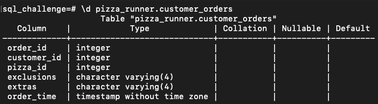
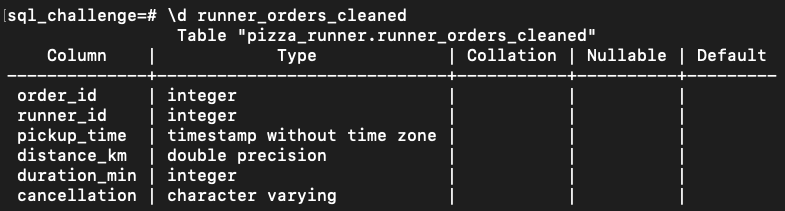

# Pizza Runner Part 0: Data Cleaning and Transforming

[Case Study 2](https://github.com/jo2eph/8-week-SQL-challenge/tree/main/case_study_2_Pizza_Runner)

Prev | [Next](https://github.com/jo2eph/8-week-SQL-challenge/blob/main/case_study_2_Pizza_Runner/1_Pizza_Metrics.md)

---

## Contents

- [Abstract](#abstract)
- [Exploring the Data](#exploring-the-data)
- [Cleaning the Data](#cleaning-the-data)
- [Combining It Together](#combining-it-together)

---

## Abstract

In this section, we are going to clean and transform our data in preparation for further analysis.

---

## Exploring the Data

Let's start by exploring our dataset to see what we are working with here.

We'll start with the `pizza_runner.customer_orders` table:

```sql
SELECT *
FROM pizza_runner.customer_orders;
```

| order_id | customer_id | pizza_id | exclusions | extras |     order_time      |
|----------|-------------|----------|------------|--------|---------------------|
|        1 |         101 |        1 |            |        | 2020-01-01 18:05:02 |
|        2 |         101 |        1 |            |        | 2020-01-01 19:00:52 |
|        3 |         102 |        1 |            |        | 2020-01-02 23:51:23 |
|        3 |         102 |        2 |            |        | 2020-01-02 23:51:23 |
|        4 |         103 |        1 | 4          |        | 2020-01-04 13:23:46 |
|        4 |         103 |        1 | 4          |        | 2020-01-04 13:23:46 |
|        4 |         103 |        2 | 4          |        | 2020-01-04 13:23:46 |
|        5 |         104 |        1 | null       | 1      | 2020-01-08 21:00:29 |
|        6 |         101 |        2 | null       | null   | 2020-01-08 21:03:13 |
|        7 |         105 |        2 | null       | 1      | 2020-01-08 21:20:29 |
|        8 |         102 |        1 | null       | null   | 2020-01-09 23:54:33 |
|        9 |         103 |        1 | 4          | 1, 5   | 2020-01-10 11:22:59 |
|       10 |         104 |        1 | null       | null   | 2020-01-11 18:34:49 |
|       10 |         104 |        1 | 2, 6       | 1, 4   | 2020-01-11 18:34:49 |

From first glance, we can see that we have some empty values in `customer_orders`.

In particular, we can see that the columns `exclusions` and `extras` have missing values.
Another thing to note is that some entries that says `'null'` are clearly meant to represent a NULL value, but they are not actually `NULL`. We will remove them in the next subsection of this note.

Next, let's examine `pizza_runner.pizza_names`.

```sql
SELECT *
FROM pizza_runner.pizza_names;
```

| pizza_id | pizza_name |
|----------|------------|
|        1 | Meatlovers |
|        2 | Vegetarian |

This table has no null values, so we don't need to do anything here.

Next, let's look at `pizza_runner.pizza_recipes`.

```sql
SELECT *
FROM pizza_runner.pizza_recipes;
```

| pizza_id |        toppings         |
|----------|-------------------------|
|        1 | 1, 2, 3, 4, 5, 6, 8, 10 |
|        2 | 4, 6, 7, 9, 11, 12      |

Once more, there are no null entries here, so we are done.

Let's look at `pizza_runner.pizza_toppings`:

```sql
SELECT *
FROM pizza_runner.pizza_toppings;
```

| topping_id | topping_name |
|------------|--------------|
|          1 | Bacon        |
|          2 | BBQ Sauce    |
|          3 | Beef         |
|          4 | Cheese       |
|          5 | Chicken      |
|          6 | Mushrooms    |
|          7 | Onions       |
|          8 | Pepperoni    |
|          9 | Peppers      |
|         10 | Salami       |
|         11 | Tomatoes     |
|         12 | Tomato Sauce |

No missing values, nothing to clean here.

Next, let's take a look at `pizza_runner.runner_orders`:

```sql
SELECT *
FROM pizza_runner.runner_orders;
```

| order_id | runner_id |     pickup_time     | distance |  duration  |      cancellation       |
|----------|-----------|---------------------|----------|------------|-------------------------|
|        1 |         1 | 2020-01-01 18:15:34 | 20km     | 32 minutes |                         |
|        2 |         1 | 2020-01-01 19:10:54 | 20km     | 27 minutes |                         |
|        3 |         1 | 2020-01-03 00:12:37 | 13.4km   | 20 mins    |                         |
|        4 |         2 | 2020-01-04 13:53:03 | 23.4     | 40         |                         |
|        5 |         3 | 2020-01-08 21:10:57 | 10       | 15         |                         |
|        6 |         3 | null                | null     | null       | Restaurant Cancellation |
|        7 |         2 | 2020-01-08 21:30:45 | 25km     | 25mins     | null                    |
|        8 |         2 | 2020-01-10 00:15:02 | 23.4 km  | 15 minute  | null                    |
|        9 |         2 | null                | null     | null       | Customer Cancellation   |
|       10 |         1 | 2020-01-11 18:50:20 | 10km     | 10minutes  | null                    |

There are a few things worth mentioning here:

- `pickup_time` column has a few `'null'` entries.
- `distance` is inconsistent with the formatting. Some of these entries don't even have a unit. `distance` also has a few `'null'` values.
- `duration` has the same problems with `distance` in that the formatting is inconsistent. Some of these rows do not have a unit. Also, there are a few `'null'` values.
- `cancellation` has empty and `'null'` entries.

We will clean eventually clean this dataset.

Lastly, we will examine `pizza_runner.runners`:

```sql
SELECT *
FROM pizza_runner.runners;
```

| runner_id | registration_date |
|-----------|-------------------|
|         1 | 2021-01-01        |
|         2 | 2021-01-03        |
|         3 | 2021-01-08        |
|         4 | 2021-01-15        |

No missing values, no inconsistent formatting, nothing to clean.

We are done. Now, it's time to actually clean our dataset.

---

## Cleaning the Data

Recall that we have two tables that needed to be cleaned:

`customer_orders` and `runner_orders`.

### `customer_orders`

Let's start with `customer_orders`.

| order_id | customer_id | pizza_id | exclusions | extras |     order_time      |
|----------|-------------|----------|------------|--------|---------------------|
|        1 |         101 |        1 |            |        | 2020-01-01 18:05:02 |
|        2 |         101 |        1 |            |        | 2020-01-01 19:00:52 |
|        3 |         102 |        1 |            |        | 2020-01-02 23:51:23 |
|        3 |         102 |        2 |            |        | 2020-01-02 23:51:23 |
|        4 |         103 |        1 | 4          |        | 2020-01-04 13:23:46 |
|        4 |         103 |        1 | 4          |        | 2020-01-04 13:23:46 |
|        4 |         103 |        2 | 4          |        | 2020-01-04 13:23:46 |
|        5 |         104 |        1 | null       | 1      | 2020-01-08 21:00:29 |
|        6 |         101 |        2 | null       | null   | 2020-01-08 21:03:13 |
|        7 |         105 |        2 | null       | 1      | 2020-01-08 21:20:29 |
|        8 |         102 |        1 | null       | null   | 2020-01-09 23:54:33 |
|        9 |         103 |        1 | 4          | 1, 5   | 2020-01-10 11:22:59 |
|       10 |         104 |        1 | null       | null   | 2020-01-11 18:34:49 |
|       10 |         104 |        1 | 2, 6       | 1, 4   | 2020-01-11 18:34:49 |

```sql
SELECT *
FROM pizza_runner.customer_orders AS co
WHERE co.exclusions IS NULL
OR co.extras IS NULL;
```

| order_id | customer_id | pizza_id | exclusions | extras |     order_time      |
|----------|-------------|----------|------------|--------|---------------------|
|        3 |         102 |        2 |            |        | 2020-01-02 23:51:23 |

According to this, there is only one row where either `exclusions` or `extras` is null.
That doesn't seem right.
Upon closer examination, we'll see that the entries where there is supposed to be a null value aren't actually null.
Some of these are actually represented using a string value 'null'.

Let's write a SQL query to clean our dataset, removing the null values in `customer_orders` and replacing it with an empty string `''`.

```sql
-- Clean customer_orders
SELECT
    co.order_id,
    co.customer_id,
    co.pizza_id,
    -- Replace nulls in exclusions
    CASE
        WHEN co.exclusions IS NULL OR co.exclusions LIKE 'null' THEN ''
        ELSE co.exclusions
    END AS exclusions,
    -- Replace nulls in extras
    CASE
        WHEN co.extras IS NULL OR co.extras LIKE 'null' THEN ''
        ELSE co.extras
    END AS extras,
    co.order_time
FROM pizza_runner.customer_orders AS co;
```

| order_id | customer_id | pizza_id | exclusions | extras |     order_time      |
|----------|-------------|----------|------------|--------|---------------------|
|        1 |         101 |        1 |            |        | 2020-01-01 18:05:02 |
|        2 |         101 |        1 |            |        | 2020-01-01 19:00:52 |
|        3 |         102 |        1 |            |        | 2020-01-02 23:51:23 |
|        3 |         102 |        2 |            |        | 2020-01-02 23:51:23 |
|        4 |         103 |        1 | 4          |        | 2020-01-04 13:23:46 |
|        4 |         103 |        1 | 4          |        | 2020-01-04 13:23:46 |
|        4 |         103 |        2 | 4          |        | 2020-01-04 13:23:46 |
|        5 |         104 |        1 |            | 1      | 2020-01-08 21:00:29 |
|        6 |         101 |        2 |            |        | 2020-01-08 21:03:13 |
|        7 |         105 |        2 |            | 1      | 2020-01-08 21:20:29 |
|        8 |         102 |        1 |            |        | 2020-01-09 23:54:33 |
|        9 |         103 |        1 | 4          | 1, 5   | 2020-01-10 11:22:59 |
|       10 |         104 |        1 |            |        | 2020-01-11 18:34:49 |
|       10 |         104 |        1 | 2, 6       | 1, 4   | 2020-01-11 18:34:49 |

Let's check to see if our cleaned table is in the correct format.

Note that I am using **PostgreSQL** command line for this project.
Depending on what database you use, the syntax may vary.

```zsh
\d pizza_runner.customer_orders
```



Awesome!

Last thing we need to do is save our cleaned dataset to a table.
One option is to remove the original, messy table and replace it with our cleaned table.
However, we are going to actually keep the original table. Instead, we are going to save our cleaned data into a separate table, which we will save it as `customer_orders_cleaned`.

Thus, our final SQL query for cleaning `customer_orders` is as follows.

*Note: the SQL file for this query can be found in the `SQL` folder, which is in the same directory as this markdown.*

```sql
-- Cleaning customer_orders dataset
CREATE TABLE customer_orders_cleaned AS (
    SELECT
        co.order_id,
        co.customer_id,
        co.pizza_id,
        CASE
            WHEN co.exclusions IS NULL THEN ''
            WHEN co.exclusions LIKE 'null' THEN ''
            ELSE co.exclusions
        END AS exclusions,
        CASE
            WHEN co.extras IS NULL THEN ''
            WHEN co.extras LIKE 'null' THEN ''
            ELSE co.extras
        END AS extras,
        co.order_time
    FROM pizza_runner.customer_orders AS co
);
```

### `runner_orders`

Lastly, we need to clean the `runner_orders` table.

| order_id | runner_id |     pickup_time     | distance |  duration  |      cancellation       |
|----------|-----------|---------------------|----------|------------|-------------------------|
|        1 |         1 | 2020-01-01 18:15:34 | 20km     | 32 minutes |                         |
|        2 |         1 | 2020-01-01 19:10:54 | 20km     | 27 minutes |                         |
|        3 |         1 | 2020-01-03 00:12:37 | 13.4km   | 20 mins    |                         |
|        4 |         2 | 2020-01-04 13:53:03 | 23.4     | 40         |                         |
|        5 |         3 | 2020-01-08 21:10:57 | 10       | 15         |                         |
|        6 |         3 | null                | null     | null       | Restaurant Cancellation |
|        7 |         2 | 2020-01-08 21:30:45 | 25km     | 25mins     | null                    |
|        8 |         2 | 2020-01-10 00:15:02 | 23.4 km  | 15 minute  | null                    |
|        9 |         2 | null                | null     | null       | Customer Cancellation   |
|       10 |         1 | 2020-01-11 18:50:20 | 10km     | 10minutes  | null                    |

For this table, we need to address the following issues:

- `pickup_time` column has a few `'null'` entries.
- `distance` is inconsistent with the formatting. Some of these entries don't even have a unit. `distance` also has a few `'null'` values.
- `duration` has the same problems with `distance` in that the formatting is inconsistent. Some of these rows do not have a unit. Also, there are a few `'null'` values.
- `cancellation` has empty and `'null'` entries.

Let's start by replacing the null entries in `pickup_time` with an empty string.

```sql
SELECT
    ro.order_id,
    ro.runner_id,
    -- Replace nulls in pickup_time
    CASE
        WHEN ro.pickup_time IS NULL OR ro.pickup_time LIKE 'null' THEN ''
        ELSE ro.pickup_time
    END AS pickup_time,
    ro.distance,
    ro.duration,
    ro.cancellation
FROM pizza_runner.runner_orders AS ro
```

| order_id | runner_id |     pickup_time     | distance |  duration  |      cancellation       |
|----------|-----------|---------------------|----------|------------|-------------------------|
|        1 |         1 | 2020-01-01 18:15:34 | 20km     | 32 minutes |                         |
|        2 |         1 | 2020-01-01 19:10:54 | 20km     | 27 minutes |                         |
|        3 |         1 | 2020-01-03 00:12:37 | 13.4km   | 20 mins    |                         |
|        4 |         2 | 2020-01-04 13:53:03 | 23.4     | 40         |                         |
|        5 |         3 | 2020-01-08 21:10:57 | 10       | 15         |                         |
|        6 |         3 |                     | null     | null       | Restaurant Cancellation |
|        7 |         2 | 2020-01-08 21:30:45 | 25km     | 25mins     | null                    |
|        8 |         2 | 2020-01-10 00:15:02 | 23.4 km  | 15 minute  | null                    |
|        9 |         2 |                     | null     | null       | Customer Cancellation   |
|       10 |         1 | 2020-01-11 18:50:20 | 10km     | 10minutes  | null                    |

Perfect.

Now we need to clean the `distance` column.

Notice that the format is inconsistent.
Some of these rows are formatted like 20km.
Others are formatted like 23.4 km, where there's a space between the number and the unit.
Some of these don't even have a unit.
For the entries with no units, we will assume that the unit is kilometers (km).
Lastly, we need to replace the string 'null'.

So, what we are going to do is remove the units from each of these, so that only the numbers remain.
Since we are going to remove the units, we will rename the column to `distance_km` so that we know what unit it is.
For this, we are going to use the `TRIM` command to remove the units, ensuring only the numbers remain.

Thus, our updated SQL query looks like this:

```sql
-- Cleaning runner_orders dataset
CREATE TABLE runner_orders_cleaned AS (
    SELECT
        ro.order_id,
        ro.runner_id,
        -- Replace nulls in pickup_time
        CASE
            WHEN ro.pickup_time IS NULL OR ro.pickup_time LIKE 'null' THEN ''
            ELSE ro.pickup_time
        END AS pickup_time,
        -- Clean distance
        CASE
            WHEN ro.distance IS NULL OR ro.distance LIKE 'null' THEN ''
            WHEN ro.distance LIKE '%km' THEN TRIM('km' FROM ro.distance)
            ELSE ro.distance
        END AS distance_km,
        ro.duration,
        ro.cancellation
    FROM pizza_runner.runner_orders AS ro
);
```

| order_id | runner_id |     pickup_time     | distance_km |  duration  |      cancellation       |
|----------|-----------|---------------------|-------------|------------|-------------------------|
|        1 |         1 | 2020-01-01 18:15:34 | 20          | 32 minutes |                         |
|        2 |         1 | 2020-01-01 19:10:54 | 20          | 27 minutes |                         |
|        3 |         1 | 2020-01-03 00:12:37 | 13.4        | 20 mins    |                         |
|        4 |         2 | 2020-01-04 13:53:03 | 23.4        | 40         |                         |
|        5 |         3 | 2020-01-08 21:10:57 | 10          | 15         |                         |
|        6 |         3 |                     |             | null       | Restaurant Cancellation |
|        7 |         2 | 2020-01-08 21:30:45 | 25          | 25mins     | null                    |
|        8 |         2 | 2020-01-10 00:15:02 | 23.4        | 15 minute  | null                    |
|        9 |         2 |                     |             | null       | Customer Cancellation   |
|       10 |         1 | 2020-01-11 18:50:20 | 10          | 10minutes  | null                    |

Lastly, we need to clean the `duration` column.

Similar to `distance`, `duration` has inconsistent formatting, and it has null values represented by the string 'null'.
Let's do a similar process with what we did to `distance`.

Our updated SQL query looks like this:

```sql
SELECT
    ro.order_id,
    ro.runner_id,
    -- Replace nulls in pickup_time
    CASE
        WHEN ro.pickup_time IS NULL OR ro.pickup_time LIKE 'null' THEN ''
        ELSE ro.pickup_time
    END AS pickup_time,
    -- Clean distance
    CASE
        WHEN ro.distance IS NULL OR ro.distance LIKE 'null' THEN ''
        WHEN ro.distance LIKE '%km' THEN TRIM('km' FROM ro.distance)
        ELSE ro.distance
    END AS distance_km,
    -- Clean duration
    CASE 
        WHEN ro.duration IS NULL OR ro.duration LIKE 'null' THEN ''
        WHEN ro.duration LIKE '%min' THEN TRIM('min' FROM ro.duration)
        WHEN ro.duration LIKE '%mins' THEN TRIM('mins' FROM ro.duration)
        WHEN ro.duration LIKE '%minute' THEN TRIM('minute' FROM ro.duration)
        WHEN ro.duration LIKE '%minutes' THEN TRIM('minutes' FROM ro.duration)
        ELSE ro.duration
    END AS duration_min,
    ro.cancellation
FROM pizza_runner.runner_orders AS ro
```

| order_id | runner_id |     pickup_time     | distance_km | duration_min |      cancellation       |
|----------|-----------|---------------------|-------------|--------------|-------------------------|
|        1 |         1 | 2020-01-01 18:15:34 | 20          | 32           |                         |
|        2 |         1 | 2020-01-01 19:10:54 | 20          | 27           |                         |
|        3 |         1 | 2020-01-03 00:12:37 | 13.4        | 20           |                         |
|        4 |         2 | 2020-01-04 13:53:03 | 23.4        | 40           |                         |
|        5 |         3 | 2020-01-08 21:10:57 | 10          | 15           |                         |
|        6 |         3 |                     |             |              | Restaurant Cancellation |
|        7 |         2 | 2020-01-08 21:30:45 | 25          | 25           | null                    |
|        8 |         2 | 2020-01-10 00:15:02 | 23.4        | 15           | null                    |
|        9 |         2 |                     |             |              | Customer Cancellation   |
|       10 |         1 | 2020-01-11 18:50:20 | 10          | 10           | null                    |

Finally, we need to clean the `cancellation` column by removing the null entries.

Thus, our updated SQL query is as follows:

```sql
SELECT
    ro.order_id,
    ro.runner_id,
    -- Replace nulls in pickup_time
    CASE
        WHEN ro.pickup_time IS NULL OR ro.pickup_time LIKE 'null' THEN ''
        ELSE ro.pickup_time
    END AS pickup_time,
    -- Clean distance
    CASE
        WHEN ro.distance IS NULL OR ro.distance LIKE 'null' THEN ''
        WHEN ro.distance LIKE '%km' THEN TRIM('km' FROM ro.distance)
        ELSE ro.distance
    END AS distance_km,
    -- Clean duration
    CASE 
        WHEN ro.duration IS NULL OR ro.duration LIKE 'null' THEN ''
        WHEN ro.duration LIKE '%min' THEN TRIM('min' FROM ro.duration)
        WHEN ro.duration LIKE '%mins' THEN TRIM('mins' FROM ro.duration)
        WHEN ro.duration LIKE '%minute' THEN TRIM('minute' FROM ro.duration)
        WHEN ro.duration LIKE '%minutes' THEN TRIM('minutes' FROM ro.duration)
        ELSE ro.duration
    END AS duration_min,
    -- Clean cancellation
    CASE
        WHEN ro.cancellation IS NULL OR ro.cancellation LIKE 'null' THEN ''
        ELSE ro.cancellation
    END AS cancellation
FROM pizza_runner.runner_orders AS ro
```

| order_id | runner_id |     pickup_time     | distance_km | duration_min |      cancellation       |
|----------|-----------|---------------------|-------------|--------------|-------------------------|
|        1 |         1 | 2020-01-01 18:15:34 | 20          | 32           |                         |
|        2 |         1 | 2020-01-01 19:10:54 | 20          | 27           |                         |
|        3 |         1 | 2020-01-03 00:12:37 | 13.4        | 20           |                         |
|        4 |         2 | 2020-01-04 13:53:03 | 23.4        | 40           |                         |
|        5 |         3 | 2020-01-08 21:10:57 | 10          | 15           |                         |
|        6 |         3 |                     |             |              | Restaurant Cancellation |
|        7 |         2 | 2020-01-08 21:30:45 | 25          | 25           |                         |
|        8 |         2 | 2020-01-10 00:15:02 | 23.4        | 15           |                         |
|        9 |         2 |                     |             |              | Customer Cancellation   |
|       10 |         1 | 2020-01-11 18:50:20 | 10          | 10           |                         |

Looks good, but we are not done yet.
We need to convert the columns to the correct data types.
In particular, we need to:

- convert `pickup_time` to `DATETIME`
- convert `distance_km` to `FLOAT`
- convert `duration_min` to `INT`.

This SQL query corresponds to this in PostgreSQL.

```sql
ALTER TABLE runner_orders_cleaned
    ALTER COLUMN pickup_time TYPE TIMESTAMP WITHOUT TIME ZONE 
        USING pickup_time::TIMESTAMP WITHOUT TIME ZONE,
    ALTER COLUMN distance_km TYPE FLOAT 
        USING distance_km::FLOAT,
    ALTER COLUMN duration_min TYPE INT 
        USING duration_min::INT;
```

Thus, our final SQL query is as follows:

```sql
CREATE TABLE runner_orders_cleaned AS (
    SELECT
        ro.order_id,
        ro.runner_id,
        -- Replace nulls in pickup_time
        CASE
            WHEN ro.pickup_time IS NULL OR ro.pickup_time LIKE 'null' THEN NULL
            ELSE ro.pickup_time
        END AS pickup_time,
        -- Clean distance
        CASE
            WHEN ro.distance IS NULL OR ro.distance LIKE 'null' THEN NULL
            WHEN ro.distance LIKE '%km' THEN TRIM('km' FROM ro.distance)
            ELSE ro.distance
        END AS distance_km,
        -- Clean duration
        CASE 
            WHEN ro.duration IS NULL OR ro.duration LIKE 'null' THEN NULL
            WHEN ro.duration LIKE '%min' THEN TRIM('min' FROM ro.duration)
            WHEN ro.duration LIKE '%mins' THEN TRIM('mins' FROM ro.duration)
            WHEN ro.duration LIKE '%minute' THEN TRIM('minute' FROM ro.duration)
            WHEN ro.duration LIKE '%minutes' THEN TRIM('minutes' FROM ro.duration)
            ELSE ro.duration
        END AS duration_min,
        -- Clean cancellation
        CASE
            WHEN ro.cancellation IS NULL OR ro.cancellation LIKE 'null' THEN NULL
            ELSE ro.cancellation
        END AS cancellation
    FROM pizza_runner.runner_orders AS ro
);

-- Changing data types in runner_orders_cleaned
ALTER TABLE runner_orders_cleaned
    ALTER COLUMN pickup_time TYPE TIMESTAMP WITHOUT TIME ZONE 
        USING pickup_time::TIMESTAMP WITHOUT TIME ZONE,
    ALTER COLUMN distance_km TYPE FLOAT 
        USING distance_km::FLOAT,
    ALTER COLUMN duration_min TYPE INT 
        USING duration_min::INT;
```

Let's check to make sure our cleaned data is in the correct datatype using the following command in the PostgreSQL command line:

```zsh
\d runner_orders_cleaned
```



---

## Combining It Together

To recap, we have cleaned the dataset for Case Study 2.
In particular, we've cleaned the tables `customer_orders` and `runner_orders` by replacing null values,
fixing inconsistent formatting, and converting to proper data types.

Now, we are going to wrap everything up by combining them all into a single SQL file that we can execute.

In addition to combining everything we've done,
we are also going to add a few extra commands to the top that deletes the cleaned tables if they exist.
This is not strictly necessary,
but I think it's better to add this in so that we can execute this SQL file repeatedly,
especially if we want to test or write different queries to it.

The final SQL file for everything we've done for cleaning our dataset can be found in `./SQL/0_clean.sql`.

```sql
/*
SQL query to clean the datasets for Case Study 2 Pizza Runner
*/

-- Drop cleaned tables if they already exist --
DROP TABLE IF EXISTS pizza_runner.customer_orders_cleaned;
DROP TABLE IF EXISTS pizza_runner.runner_orders_cleaned;

-- Cleaning customer_orders dataset
CREATE TABLE customer_orders_cleaned AS (
    SELECT
        co.order_id,
        co.customer_id,
        co.pizza_id,
        -- Replace nulls in exclusions
        CASE
            WHEN co.exclusions IS NULL OR co.exclusions LIKE 'null' THEN ''
            ELSE co.exclusions
        END AS exclusions,
        -- Replace nulls in extras
        CASE
            WHEN co.extras IS NULL OR co.extras LIKE 'null' THEN ''
            ELSE co.extras
        END AS extras,
        co.order_time
    FROM pizza_runner.customer_orders AS co
);

-- Cleaning runner_orders dataset
CREATE TABLE runner_orders_cleaned AS (
    SELECT
        ro.order_id,
        ro.runner_id,
        -- Replace nulls in pickup_time
        CASE
            WHEN ro.pickup_time IS NULL OR ro.pickup_time LIKE 'null' THEN NULL
            ELSE ro.pickup_time
        END AS pickup_time,
        -- Clean distance
        CASE
            WHEN ro.distance IS NULL OR ro.distance LIKE 'null' THEN NULL
            WHEN ro.distance LIKE '%km' THEN TRIM('km' FROM ro.distance)
            ELSE ro.distance
        END AS distance_km,
        -- Clean duration
        CASE 
            WHEN ro.duration IS NULL OR ro.duration LIKE 'null' THEN NULL
            WHEN ro.duration LIKE '%min' THEN TRIM('min' FROM ro.duration)
            WHEN ro.duration LIKE '%mins' THEN TRIM('mins' FROM ro.duration)
            WHEN ro.duration LIKE '%minute' THEN TRIM('minute' FROM ro.duration)
            WHEN ro.duration LIKE '%minutes' THEN TRIM('minutes' FROM ro.duration)
            ELSE ro.duration
        END AS duration_min,
        -- Clean cancellation
        CASE
            WHEN ro.cancellation IS NULL OR ro.cancellation LIKE 'null' THEN NULL
            ELSE ro.cancellation
        END AS cancellation
    FROM pizza_runner.runner_orders AS ro
);

-- Changing data types in runner_orders_cleaned
ALTER TABLE runner_orders_cleaned
    ALTER COLUMN pickup_time TYPE TIMESTAMP WITHOUT TIME ZONE 
        USING pickup_time::TIMESTAMP WITHOUT TIME ZONE,
    ALTER COLUMN distance_km TYPE FLOAT 
        USING distance_km::FLOAT,
    ALTER COLUMN duration_min TYPE INT 
        USING duration_min::INT;
```

We are done with the data cleaning process.
Now, we can proceed to do some actual analysis, and answer the case study questions,
which we will start in the [next](https://github.com/jo2eph/8-week-SQL-challenge/blob/main/case_study_2_Pizza_Runner/1_Pizza_Metrics.md)
portion.

---

[Return to Top](#pizza-runner-part-0-data-cleaning-and-transforming)

Prev | [Next](https://github.com/jo2eph/8-week-SQL-challenge/blob/main/case_study_2_Pizza_Runner/1_Pizza_Metrics.md)
